# Status Log

This is the documentation of the amp state.

## 2020-09-23

I was not really happy with the way the preamp sounds. The original preamp circuit as it was sounds ok. But the crunch mode I put in to feed the two stages together just does not sound good to me. When the gain is turned up it sounds harsh and shrill. And when I use it with the gain lower to get clean tone, I am able to get a bit of that nice "glassy" sound I like. But It also sounds very thin. This is likely because the way I have the first stage wired currently with the 1uF capacitor and 2.7K resistor to bypass the cathode, that Is most likely because it gets more gain after 1KHz.

* Convert the J1, the "lo" input to be a direct connection to input of RV2 (2nd volume knob), that goes directly into V2A (the 12AT7 preamplifier before cathode follower for tone stack.). This will allow me to bypass the preamp circuit all together. RV2 is now a "master volume"
* Wire in the RG-178 cable as the path from output of preamp, through J1, and into RV1. The idea is to have as much shielding from noise as possible in the early stage here. Since we kind of have a bit more signal path length here now.
* Change C34 (cathode bypass cap on V2A for tone stack preamp) from 1uF to 270uF. This is now the same effect as what the first preamp stage used to be. Looking for more gain here, as well as a flatter frequency response.
* Change C4 from 0.02uF,400V to 0.1uF,400V. Looking to have better passsing of all frequencies here.

With this, we are able to completely de-populate V1 (preamp stages.) Completely remove the preamp module and V1 for now.

Going to work on designing a good preamp circuit on a breadboard for a bit.

I noticed before when using the amp, when I turn the reverb mix knob over all the way it causes amp buzzing, like power loss and oscillations.

* Add 68K resistor between the pin 3 of RV7 (reverb mix) and the existing 36K resistor. - I guess I can just make this a 100K resistor. But interested in seeing if this fixes the problem...

That seems to solve the oscillations.

But I notice, when I have the mix knob over on all the way to dry amp, i hear buzzing sound. When I move it all the way wet reverb, i hear a different kind of hum sound.

Disconnect the audio intput to the op-amp plase inverter. It is indeed super silent.

Test jimpering the input from J1 now direct from guitar into the op-amp input. I hear pristine clear sound.

So the part from the phase inverter through power stage is perfect.  The noise is coming some where in the tone stack, reverb.

Connect the guitar into the effct return connector. This bypasses the tone stack and goes straight into the reverb section. Reconnect reverb output to the op-amp phase inverter. Ok. that also sounds really good.

So the buzzy problem is coming from the tone stack?
Replace the 12AT7 with a 12AX7. Ok. In this circuit this seems to work a lot better. No crazy loud hum / buzzing. I wonder if this 12AT7 tube went bad. Will test in my desk audio amp later..

Though this showed me I have a lot less problems without the tone stack. Maybe I should work on replacing this with an op-amp driven EQ as well?
We need V2 in there, that is the only preamp we have with the volume control there.

What if we try to jumper pin 3 (output of cathode follower) of V2, to J9 (effect send). This keeps the valve preamp, but bypasses the tone stack.
No, still hear the hum and buzz. And it still changes when moving the reverb mix knob.

Notice the pin 6 and pin 2 are wired together, but go under the filament supply. Maybe this is just too close to this AC signal and it is picking up the hum from that? This was the original soldering of the socket, I had not changed it all this time.  Disconnect these two pins, wire a wire around them. Also remove the on-socket resistor. Make this be in a wire now. It was also the original 100K resistor. Replace this with a modern metal film resistor.

Leave the 2nd half of V2 disconnected. Jumper a 0.1uf capacitor to pin 6, so it can be connected directly to J9 (output of the tone stack). This bypasses the tone stack all together.
Still wretched hum.
Try swapping V2 with a different tube. Same.
Pull V2 out all together. Ah still lots of hum.
Plug in the effects return. hum goes away. ok something is wrong here.
Finish rewiring the other half of V2. Maybe the floating grid is causing some instabilities here.
Ok, the hum seems to have gone a lot more away.
If I turn the reverb mix all the way over, there is a very faint hum now. But this is likely the lack of quality of signal going to my reverb unit.
But wow, way less hum than I had.  That fucking tube socket wiring was causing a bit of this hum the amp has always had!!.
Any how, no more oscillating or squealing when reverb knobs are turned all ways.
Put back the 12AT7 tube. It seems to work well here.
Continue to add more RG-178 wire along the signal path, from the tone stack components, tube socket to the pots.

At the moment there is entirely no preamp circuit. Guitar into the input works, but is not very loud, even on max volume. This is now like a 500mw bedroom amplifier.
But, I can work on experimenting with preamp designs with the amp not ripped apart, and with the assumption that this amp as it is, is now a clean power amp. At least at lower volumes like i am testing now. That is the tonal character needs to come from the preamp.

From the testing tonight it became clear how I could more effectively bypass the tone stack. By placing a 0.1uF capacitor onto pin 6 of V2 and adding a toggle switch after RV3, before J9 effects send. Go ahead and put that in. Use more RG-179 back to the capacitor on the tube socket.
I don't always want to bypass the tone stack. But at least I can now if I do want to.

## 2020-09-06

While trying to solve an unrelated problem with a bad patch cable I thought the problem was the bug with the missing resistor to ground. Take apart the amp and add an 820K resistor. So that spot on the reverb blend knob is like a fixed gain pot after the reverb recovery tube.

I guess that is it for bugs for now.

## 2020-09-05

* Notice the volume output gets reduced a lot when I have the reverb mix towards the wet reverb signal. I suspect the 50k reverb tone control is attenuating the output from the 12AX7 that recovers the signal from the reverb tank too much. Also this tone knob does not seem to do anything to the tone, except cause undesired oscillations somtimes when it is all the way over. Try to replace the reverb tone stack with a single 1M pot to ground, like the output pot on the gain stages.
* Taking it out all the way does help. But I find I can't turn it up all the way, I get distorted sound. From experimentation find that about 36K is a good resistor to use. This lets me completely remove the pot. That works. I only need dwell and mix.

Happy. This fixed the duck in volume when the reverb was on all the way, and the random oscillations on high gain settings when reverb tone knob was in some not ideal position.

Dammit. Just get it together and notice when the reverb blend is maximum it makes farting oscillations. I guess I need a resistance to ground coming out of the reverb recovery stage to drop the level a bit.  So a new bug to fix next time I take it apart.

## 2020-09-04

* Change the feedback resistor (R28 from 82K to 200K). Before it had helped things when this was lower. But now with the op-amp phase inverter I guess the feedback is different. I felt tha amp was not loud enough, or it lacked in detail and articulation a bit.  I first tried to add in a resonance control, make this a 1M pot. But I found that it does not really make a noticable change in sound. And that 150K is the lowest we can go before it starts to do oscillations at high gain settings.
* Attempted to add a presence control to feedback path. But this caused high pitch oscillations. Undo.
* Change phase inverter op amp feedback resistor (R69) to 20K. I don't know why I had 18K. I think I experimented to find this was about right setting on the gain knob. But I have 20K resisters everywhere else there right. So try it to see if it still works. It does.  This stage now has a gain of 20 instead of 18.

Setting the feedback resistor seemed to help stop the squeal at high gain settings. I need to play more with the settings and see, but it does feel a lot better now.

* Remove the S1 (clean / crunch switch) from the signal path. I basically like having two tube gain stages in series all the time. So I now have 2 volume knobs all the time as well.
* Investigate using the crunch swith to engage some [clipping diodes](https://warpedmusician.wordpress.com/2014/01/23/adding-diodes-to-tube-amps/) after the first gain stage then. I tried them on their own and it was ok. But I don't like how it sounds with my usual guitar sound setup. It almost sounds like a fuzz pedal. Not my thing. Remove the diodes. Something to revisit some other time with something else. At least we tried.
* Delete R62 and R63 (360K between output of  gain stage and volume pots ). This was attempt to stop that whacky oscillations at high gain settings.
* Not entirely happy without that S1 (clean/crunch) switch to allow me to use one preamp stage like it originally was. Or both in series. I feel sometimes the single stage is warmer and has better bass response.  So. undo taking that out.

Kind of a day where I try things and then undo them. I guess a small bit of tidy ups from previous hacking attempts.

For now the amp is really good at clean channel sounds.

## 2020-08-30

Realize I did not put in cathode bypass capacitors to the tube gain stage following the op-amp phase inverter. I don't need these, but any bit more gain that is possible is a good thing I think.  Take apart the amp quickly and put them in and then put the amp back together.

## 2020-08-29

It felt like the reverb signal was still clipping too often. I hear crunchy or distorted sounds coming out when I want clean tone. I think it is the super overdriven reberb signal.
Add a 0.02uF capacitor and a 4.7K resistor in series to the input to the 12AT7 of the reverb drive circuit.
This seems to help it a bit.

Take a look at the reverb tank input signal on the Hantek scope. Observer there is no clipping there under various level settings.

I am now super excited about how this amplifier sounds.
Words to describe it include articulate, superb clarity, excellent responsiveness. It is picking up nuances of my fingers or picking I have not heard before. So now I need to work on improving my playing abilities to make use of these new features.

Put the amp back together into its case.

## 2020-08-28

* Install female IEC power connector after the switch, so I can plug in my pedal board to the amp and have it controlled by the amp power switch. One less stupid cord on the floor now.
* Remove the variable resistor I had in series with power tube screens. It was not doing anything.
* Remove the variable resistors I had to the power tube grids to attempt to bias them. They do not do anything.
* Remove the high voltage test points. Repurpose 2 of the jacks as sensors for the grid to the power tubes, so we can analyze the phase inverter output.
* Try to put in 6L6GC tubes, instead of the 7027A ones that I had in there. Yep, they seem to work Ok. I am interested to see if the slightly lower power ratings of the 6L6GC help them to enter break up a bit easier.

Maybe it was the cleaning up the wiring and the adjustment pots that did nothing, but it feels a bit less buzzy now again!

Have the idea to try to build a solid state phase inverter using op-amp. This will require a +/- DC power supply. Have the idea I can use the small DC-DC converter I have with a bridge rectifier and filter cap to get this from one of the tube filament supplies.

Assemble a small module board that is this op-amp DC power supply from tube filament. It seems to work as expected.
Use a signal generator of 1kHz and 5Vpp I am able to see the output waveform using the Hantek USB oscilloscope, and it is indeed inverted phase and the same amplitude. Experimentally I am able to drive this up to the power supply rails. I find that a 25K pot is enough to make the 5V signal not quite clip. The Traynor YBA-300 schematic used a 100K pot. Then again that was likely line audio level. I will have to measure this again when I get it into the amplifier.

Here I am using the OPA2134 op-amp. I believe it can provide enough current that I do not need to use a tube to buffer it to the power tubes. I guess we will need to try it to see. I added a 1K resistor in series with the outputs.

Trying to measure the waveform from the existing phase inverter on the Hantek scope. I find when I use capacitors on the same breadboard as the test op amp, the parasitic coupling is enough I hear the 1kHz test signal in the amp. Neat. And because I am tapping into the power tubes, I can basically drive output out of the amp independently of the volume controls. Try a separate bradboard. I need to use capacitors on the end of the probes because the Hantek apparently does not have an AC coupling option. And the amplifier has a -40VDC bias on these connections from its phase splitter into the power tubes, so i need to use funky scale on the screen to see the scope trace.
But having a hard time to see a good signal. I can see one half of the guitar signal, but not the other half. It is almost a flat trace. It might be the power tubes are loading it too much to see it?  Try pulling the power tubes and measuring again.
Still only seeing the signal going into V5 (2nd power tube), not V4 (1st power tube). Check the wiring in the amp.
Check the connection. Use a probe on the signal generator on pin 6 of V4 (output from phase inverter tube) and see the signal is getting to the pin5 of V4.
Odd. It must be the tube is loading the circuit so I can't even measure a voltage change?
I am having a hard time getting a good signal. But when I turn up the tremolo I can see two sine waves of different amplitude and not shifted 180 deggrees at all. This is consistent with what I hear with my hears, the terrible buzzing problem. I have no interest in trying to investigate or adjust this long tail pair circuit.
I have a feeling some of the squealing and oscillations I am having are due to the stray capacitance and resistor networks in this tube phase inverter schematic.

Try to connect my op amp phase inverter by wiring the output from the reverb to the input to the op amp circuit on breadboard. Then wire outputs to the plug connectors. Disconnect the pin 5's from the old phase inverter that was going to power tube.
I don't like having wires coming out of the chassis, but this op amp circuit is still on a breadboard. And it is all audio level signals here.

It works!. Getting distortion at high gain, but this is because of likely not having the feedback connected. Lets test connect the feedback resistor.
It seems to be ok with feedback resistor in place. Doesn't not work anyway.
Put the tremolo oscillator tube back in. Tremolo seems to work ok too. And not having the terrible background buzz. There is a tiny bit of course. but this is normal.

I have nice sound. I can see the phase and inverter phase things happening on the scope when I connect to the output from the op-amp. The audio signal is perfetly out of phase and same amplitude. There is a bit of random buzzing noise. But I think this is just noise in my room and computer and lights and test equipment. The long unshielded wires that carry the audio signal are coming out of the amp. They probably work like antennas to pick this noise up.

The only issue is now with just the op-amp phase inverter the amp feels "too quiet". Maybe we do need to have a tube buffer then?
Since we are this far into it, lets try to repurpose the old phase inverter tube for a driver buffer tube.  Remove the phase inverter module board I had in there before. So I can always undo this later if I need to. Rewire the phase inverter tube socket to be a pair of triode preamp. I again borrowed the values from the Traynor YBA-300 schematic. Here I think the setup is for a gain of at least 50. So moderate gain.

Discover the gain knob is not really useful or needed. I found through experimentation having it at 25K causes random oscillation effects. But keeping it around 18K at the most seems to be pretty stable and good enough volume. So replace the pot with a 18K resistor. I assembled the phase inverter module all with screw terminals as the reverb module. That is such a convenient and good idea. So i just stuff a resistor into the screw terminals that were to go to the pot.

Mount the power supply board into the chassis. At first I had a short circuit on the DC+ output from the diode rectifier. This is because I put the parts too close to teh edge of the board, did not consider standoff space. And I dumbly put the positive voltage pin in the corner. I should have put the ground around the perimiter of the board. Always something to learn. I just removed the one standoff. The board will be fine with three. The power transformer is a beast. It kept putting out about 4V when it was loaded up from a shorted out rectifier diode. The diode bridge got pretty hot. But i heard it making crackle sound and smelled it before i left it on very long. I think it is going to be ok anyway.

* Replace the 12AT7 in the phase inverter section for the ECC803S it was before. Now that I have the op-amp phase inverter I can benefit from having the slightly more gain in the output into the power tubes.

Test the amplifier now. It is whisper quiet. That buzzing and clicking I had intermittantly when it was on the breadboard is now gone. I figured it was just the wires working like antenna to pick up noise from the room.

This amplifier is now almost as quiet as my YBA-300 amplifier. And I have the same satisfaction I have when I fixed that amp. Really the phase inverter was likely problematic forever here. Replacing this is the biggest improvement to this amp so far.

And now I have a good size DC power supply in this amp to power op-amps. I can tinker to add other op-amp based circuits. Like active EQ. Though I am running very low on space. Stuff is going to have to start coming out before we can put any more in.

I am considering the work and changes for this amp to be complete for now. Though I am going to leave it apart this weekend, in case there is any tinkering ideas. Because lately every time I put it back together it is not even a day and I am ripping it apart again.

## 2020-08-26

* Try adding a 68K resistor in series between (output of reverb) and input to phase splitter. Trying to get rid of higher gain squeal problems. That seems to actually help a bit. But I just can't use the reverb tone knob at all. Might remove it later then.
  * Having this resistor in seems to make the amp sound like there is a blanket over it. Not liking it. Remove it.
* Try adding grid bias adjust resistors to inputs of V4 and V5, the [two bias adjustments configuration](https://www.apexmatching.com/why-should-i-match-my-tubes-technicians-explanation). This also will require us to put test plugs up on the HT wire. The things we do for science. Measure the resistance and then the voltage drop through the transformer to infer current.
  * This seems to be bad for this amp. It runs the tubes about twice as hot (you can tell by the smell too). And the tremolo circuit seems to bust. Undo the ground connection on the new bias resistors, so they are still in there in series with the 220K resistors, but I don't think they are doing anything. I might remove these pots later then sometime.
* Experiment with adding a 500K pot in the feedback loop from the output. It sounds a bit louder and crunchier when this resistor is larger. But I also like how nice it sounds when this value is low. I tried making the feedback small, 68K, and that even sounds good. So put it back to 82K and remove the pot. (R28 used to be 100K)
* Try to remove the reverb tone knob. Nope. It squeals more. The oscillations are somehow controlled when I adjust the tone stack. So maybe the feedback needs to go earlier into the amp stages.
* Experiment to add a 100K resistor in parallel with C38 (connecting to the reverb mix knob). It seems to help a bit. or do nothing. Which ever.

So a couple things that did not make a difference. But I guess this is how we learn too.

I hear when testing, it is possible to overdrive the reverb, and I am hearing a bit crunch from the reverb in clean tone. That is a neat effect.

* Try to swap out the phase inverter (which was ECC803) to a 12AT7. Lower gain to the power tubes. Trying to see if this removes squaling problem. It does not. but it seems to still sound ok.

## 2020-08-22

* Swap out the 12AX7 in V2 (tone stack buffers) for a 12AT7. I can't tell entirely if it is helping remove some of that squeal oscillations. But it doesn't not work and seems to sound ok. So going to try leaving it in there for a bit. I did have a JJ ECC83 tube in there before.
* Swap out the Sovtek 12AX7 in V1 (preamp) for the JJ ECC83 I took out from V2. That seems to again improve the sound character and reduce the squaling.

## 2020-08-20

Assemble the discrete RC components on the circuit board and where it makes sense on the chassis.
Using screw terminal connectors to interface between the board and the chassis. Update the schematic with these connectors.

Use a multimeter to probe the circuit and verify things are connected to where they are supposed to be.

Wanting to test the components rather than hooking it all up at once. Added 34 test points to the schematic. Can work on measuring and documenting voltages and observing and learning wave forms. Some are high voltage so need to be super careful.

* Test 1: Populate just the V8 tube of reverb unit. Hook up the audio from the FX return through V8A, through RV7 to power stage. Populate just V8 12AX7 tube. Expecting the amp continues to work and produce sound.
  * Ok. I do hear amp audio. When I turn up the level for reverb I do hear high frequency oscillating though. Pretty sure I should not. Notice when things warm up the squealing goes away.

* Test 2: Still with only the V8 tube populated, hook up a signal to the reverb tank return connection. Expecting to be able to hear that on the output.
  * Ok. Plugged guitar into the reverb tank return. Able to hear it and control its volume level with the reverb mix potentiometer.

* Test 3: Populate all tubes. Connect a speaker instead of the reverb tank. Expecting to hear the sound from the reverb circuit output.
  * Ok. I hear audio coming out! It is not overly loud or overly distorted. But I hear it. Kind of tinny. But it is there.

* Test 4: Connect the reverb tank. Expecting to have reverb effect work.
  * Ok. I hear sweet reverb sounds. Nice!

Mount the reverb tank. Put the amp back together.

While putting the kids to bed. Have the thought. Hm. Maybe the T3 reverb drive transformer should be connected directly to V2, instead of following the 4.7K resistor, so it operates V9 at a slightly higher voltage. And then the R54 (4.7K screen resistor) should also go to V2.  Dammit. How come I didn't realize that before. Update the schematic. Take apart the amp. Move (1) small wire a little bit over on my reverb driver circuit board. Test it. Ok. yea. There is a lot more reverb now! That is better.  Put the amp back together again.

Making small RCA patch cords to connect reverb tank to the amp chassis in the case. This is meaningful for me since I am using what is left of a RCA patch cord that I used to connect the Apple IIc computer to the television when I was a kid. I started to use it as shielded wire when working on guitars. So more personal history put into this amplifier.

## 2020-08-18

Digikey parts and NextGen Guitar tube sockets arrived today!

Rough in the parts on the chassis for the reverb circuit.

* Install V9 (EL84 in reverb circuit) tube socket.
* Move the fuze over closer to the power switch. The back panel now has more room to put potentiometers.
* Cut out a rectangle of sheet metal and screw it over the hole where one of the chassis can capacitors used to be.
* Install the RCA jacks to connect amp to the reverb tank on this new sheet metal plate.
* Mount J6 (reverb footswitch jack) into the hole where the power switch used to be.
* Mount the 3 reverb control potentiometers into the (old fuze hole, a new hole, old ground switch hole)
* Print label maker labels for the new knobs and connectors.
* Dry fit a small circuit board on standoffs to be used for the discrete components.
* Connect the driver transformer to the connector and to the tube socket.

## 2020-08-17

* Install tube sockets for the 12AX7 and 12AT7 tubes for the reverb circuit onto the chasis. Wire up the fillaments.
* The tremolo was "too fast". The slowest setting was about all I could use, but still too fast. Change C18 and C19 from 0.01uF to 0.02uF. It is a much usable range of speeds now.
* Change C8 (input to phase splitter from tone stack) from 0.02uF to 0.047uF. I think its a bit more "bassier" now.
* Experiment with a 500K pot instead of the fixed 100K resistor. Find the variability of the pot does not effect the sound as much. But having this value larger allows the sound to break up easier for sure. Change R8 from 100k to 220K.
* Update schematic. R24 and R25 are actually 100K trim pots in series with the resistors, I put in to get exactly 84K and 100K values.

Trying to reduce the oscillations I am getting when turning the gain knobs all the way up.

* Add 1K grid stop in series to input of 2nd stage preamp.
* Install a 360K in series with 1st and 2nd channel gain knobs. This seems to be the min resistance on the pot to prevent squealing when the pots are turned up more of the way. This didn't help.
* Try to install 0.001uF capacitors in parallel with the plate resistors on the preamp stages and cathode follow 100k B+ resistors.
* Swap the wires from the tubes to the output transformer (changing phase might change feedback properties?) That made it horribly worse. Put them back. And fix that scrap of solid conductor wire that was hacked onto the wire to be a tube socket lead.

I still get high pitch squeal when the gain knobs are turned most of the way up. Some kind of stray capacitance with my sloppy wires probably. But I think it is a bit better. It does not have that cut power and do a sort of hum effect, which was likely from very high frequency inaudible oscillations.
Ill leave this for now. Practically I won't crank out the gain knobs anyway right.

## 2020-08-15

Take apart the amp. Create a full updated schematic.

* fix the output transformer mounting. The bracket was bent since I got it so the transformer was kind of angled in how it was sitting. Loosten the bolt and bend the bracket. It sits flat now.
* Remove the old capacitors that were on the chassis. Wanting to make some space for the parts for the reverb circuit I am planning to add.
* Remove the switch to bypass the tone stack. It doesn't really work well or do much for me.
* Put in a separate cathode resistor and cap for the first crunch stage. I went with 2.7k and 1uF.
* That tube socket I replaced before is cheap Chinese crap. The bracket does not hold the socket very well. Find the nextgen.ca site has tube sockets. Get a bunch of these. I will need some 9 pin ones to mount the EL84 to drive the transformer to the reverb tank. I will replace the 7027 8 pin socket too when these come in. Feeling frustrated I didn't look at nextgen.ca before, that I found amplified parts.com in the US, where the cost after currency exchange, shipping, and duty, will be more than what it would have been to buy from canadian store. Also, the month or more it took to arrive. So pissed off and not going to buy stuff from US vendors any more.
* Update symbols on schematic to be more recent tube symbols.
* Update actual schematic to use part numbers of original schematic where possible.
* Draw schematic for reverb driver

* Test power transformer to see if it can power fillaments of 3 tubes (12at7, 12ax7, el84) for reverb driver circuit.
  * Wiring these 3 tubes up to my power supply, they draw 1.5A at 6.3V
  * It looks like the modern part number for the 78633 power transformer is the Hammond 291JX. This seems to be rated at 2.5A for the fillament supply.
  * There are currently 4x 12AX7 tubes. Each one of these seems to draw 0.17A each. A 7027 tube draws 0.93A each.
    So, (0.97*2) + (0.17*4) = 2.62A. That is already more than what this (modern) part is rated to supply.
    I would need this transformer to supply 4.5A fillaments. I think the new replacement part is not the correct one for this.
    Experimentally test jumpering the 3 tube fillaments to the power transformer. It seems able to turn them all on and able to make sound, not browning out. Not buzzing badly. Looking on digikey. Most similar transformers are rated at 3.5A
    I can't find a spec for this transformer. It is probably over sized for this application.
    I figure I can try to use it, and if I burn it out, it looks like [this](https://www.digikey.ca/en/products/detail/hammond-manufacturing/270FX/455411?s=N4IgTCBcDa4OwAYBiANEBdAvkA) is a repacement that is rated at 5A fillament.
* Add 1M grid stopper resistors to the inputs of V1A and V1B. Before these were on the input jack side of the 68K resistors. I feel these should be right up as close to the tube as possible. Also, because we now can switch which preamp stage the input is connected to, we now require a separate grid stopper resistor per tube.
* Change out the two 100 ohm screen current adjustment resistors. Notice on the schematic how the V+ kind of Tees into the middle of the two resistors. In practise I seem to have one of these all the way zero'd out and the other one about a third to mid way. So if I just have the wiper connected to V+ and one leg of the pot to each fixed resistor, Then I can achieve the same effect but with one knob. The pot is rated at 2 watts. I only use about 1 watt here, per tube, so this should be ok. If it breaks we can always put it back how it was before without the adjustment pot. I am not entirely convinced this makes an audible difference. Just having the same screen currents into the tubes allows the tubes to wear about the same, not having a slightly hotter tube.
* Compute a list of parts I need to build the reverb tank driver circuit, send off a DigiKey order.

## 2020-04-??

* Convert two input channels to a single input channel
* Use the second pair of inputs as an effects loop
* Add a toggle switch to allow us to cascade input stages in series if we want to
* Add toggle switch to allow to bypass tone stack
* Move the AC switch to the corner out of the way.

I know I took pictures. I can't find them now.

## 2019-03-11

Take apart the amp.

* Remove the trebble cap in parallel with the 220k resistor from the output of the first stage. I found it was just way too bright.
* Experiment with using a larger resistor, and a variable resistor for the cathode bypass resistor on the second stage. It didn't seem to make much of a difference, so take it out. End up leaving in the 820 ohm resistor i was playing with, instead of the 1.6k resistor for the second stage. It has the effect of moving up the frequency vs amplification curve a bit. So the amp continues to have a bright sound to it.
* Experiment with removing the resistors between the amp stages all together. This caused high frequency squealing, oscillation Put them back in. Really having these in here is a voltage divider, which halves the output from the first stage, which is likely why we can't get a strong overdrive with this.
* Put back the original preamp tube. I didn't like the hiss noise I was getting. it is silent again. Now I just can't crank the first gain up all the way.
* Notice the schematic for the ax84 preamp mod had the units of the tube backwards. It was not as I had built it, so it was confusing to read the schematic. Fixed.

Continue to be happy with the tonal variations I can get in clean tones with this amp.

## 2019-02-28

I changed out the preamp tube with one I had in my electronic junk bin. This one has slightly shorter plates. For what ever magic ass reason this other tube does not have the high frequency oscillations. I notice a bit more hiss and background noise like hum and crackles when the first gain is higher. I think perhaps trying different preamp tubes. I have some coming in from aliexpress. So wait and see. Maybe some good expensive ass one from tubedepot if that doesn't help. I hate the shipping though.

Changed out the 7027 tubes for a new set I ordered from tubedepot before. The new ones are a bit taller. So i can't have it mounted on my desk out of its case anymore I guess.

The new tubes are super shiny. And seem to operate not quite as hot as the old ones. I don't have any setup to check or adjust their bias. But they sound ok. And subjectively they both seem to get the same amount of hot, so not having one loaded harder anyway. Probably.

Decide the sound of the amp is good enough. It works. It plays very brightly. Sounds good for both guitar and bass guitar. Really to improve it more I would need some better speakers. I just have shitty old home stereo system "house party" speakers. Good enough for making noise when people don't care, but not a good speaker at all. When I can stop tinkering with the electronics in the amp I can focus on practicing to make music more too.

Put it back together in its chassis for now. Clear off a spot on a table for its new home.

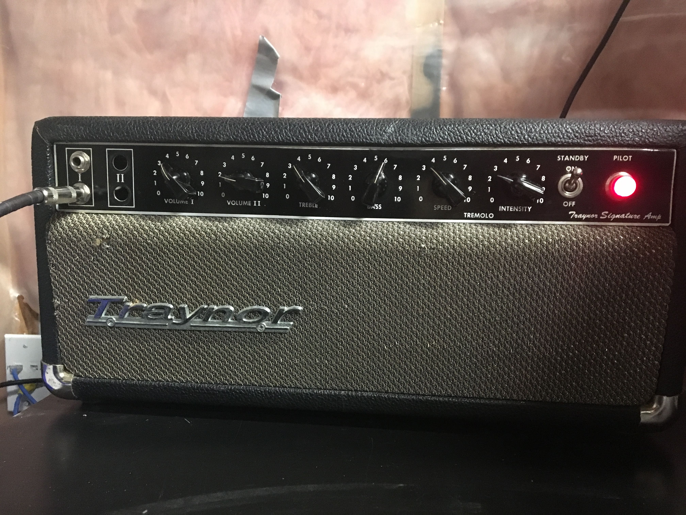

## 2019-02-27

DigiKey parts came. Happiness!

Assemble the preamp module
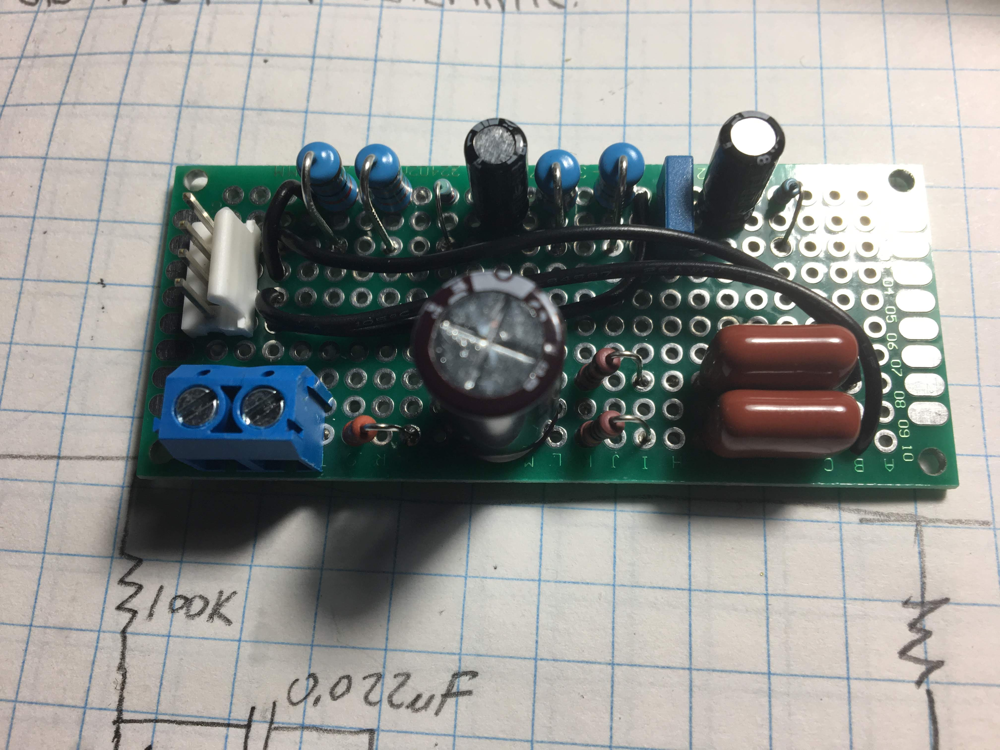

Get it wired in nicely. Try it out a little bit (but it was after kids in bed so not very loud or long).
I just plugged the guitar directly into it.
It is a lot tinnier sounding, less whole bass sounding it was before. But I have a lot of variation with the tone controls on the amp and on the guitar.

I was able to get some crunchy overdrive sounds. I noticed the volume pot is a little scratchy. And there is a weird spot where it seems to be some kind of resonant spot. You hear it sort of cut out and very high pitch hiss.  I have theory this is because the pots are 4M and not the 500K the schematic called for. I just used the ones that were on the chassis, but maybe I should have replaced them. Something to add to the next digikey order. In the mean time I will try to play with this a bit and see if I can find some good settings from it.

## 2019-02-26

Have the idea to replace the preamp circuit with one based on the [AX84 High Occtane](http://www.ax84.com/hioctane.html) amp.

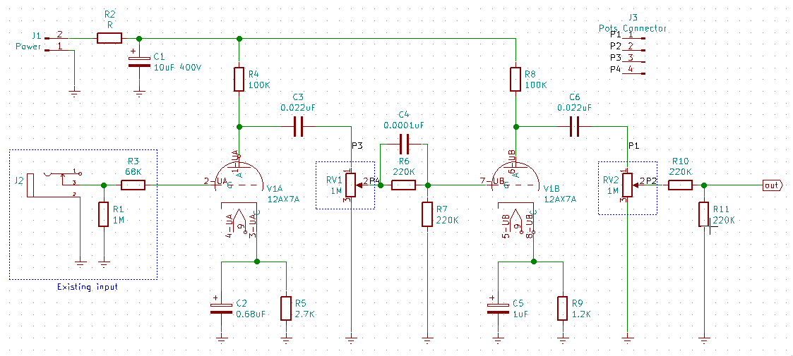

Here I am just replacing the preamp part, up to the cathode follower before the tone stack.

It will

* Replace the preamp module board.
* Remove the channel II input.
* Add a 1 uF capacitor to the cathode of the tone stack cathode follower.
* The 0.68uF capacitor on the first stage of the preamp
* The 1 uF capacitor onthe second stage.

We will lose the two separate input channels. But I don't need thse anyway. The second channel becomes the second stage in this new single channel. The existing volume knob on the front of the chassis is thus used. We will have holes where the channel II inputs used to be.

The attempt to use a connector on the preamp module before to connect to the tube does not work.

* This did not consider the separate wire for each cathode. Before both cathodes shared a single resistor and bypass capacitor. But these now are differnt.
* It did not consider the second grid input, which used to be directly wired to the input jack.

No matter. Removing and replacing the module is still the order of changing 6 wires. If we ever decide this mod is not useful and wanted to go back to the original configuration we can just rewire up the old preamp module.

I need to 16 resistors and capacitors. Of course I do not have all of these. Place a DigiKey order.

I think this will have a higher amplification for higher frequencies, providing a treble boost type of effect.
Based on the [cathode bypass calculator](https://www.ampbooks.com/mobile/amplifier-calculators/cathode-capacitor/calculator/)
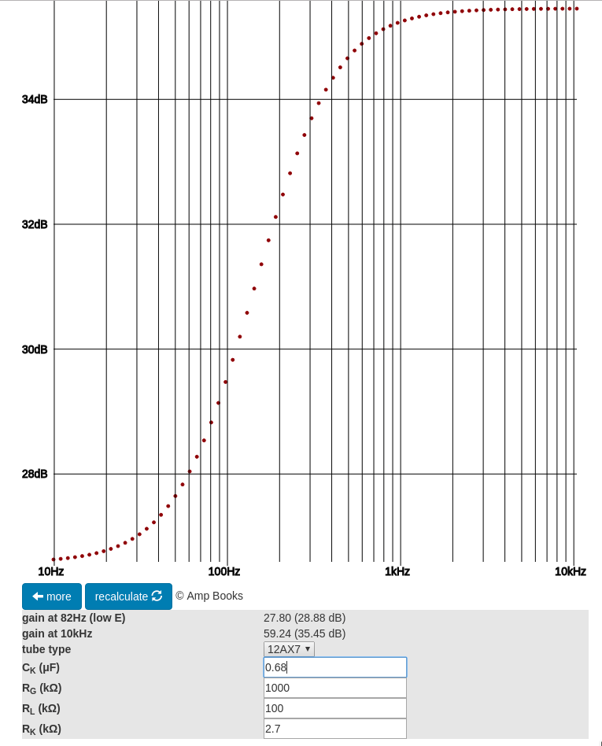

The second stage has a similar curve, with the (1uF,1.2K) cathode bypass, but with a 83Hz gain of 36 instead of 27.

I believe this is why it sounded bad before when I experimented connecting the first stage of the two channels together in series. The configuration of the Traynor preamp is pretty flat amplification over all frequencies.

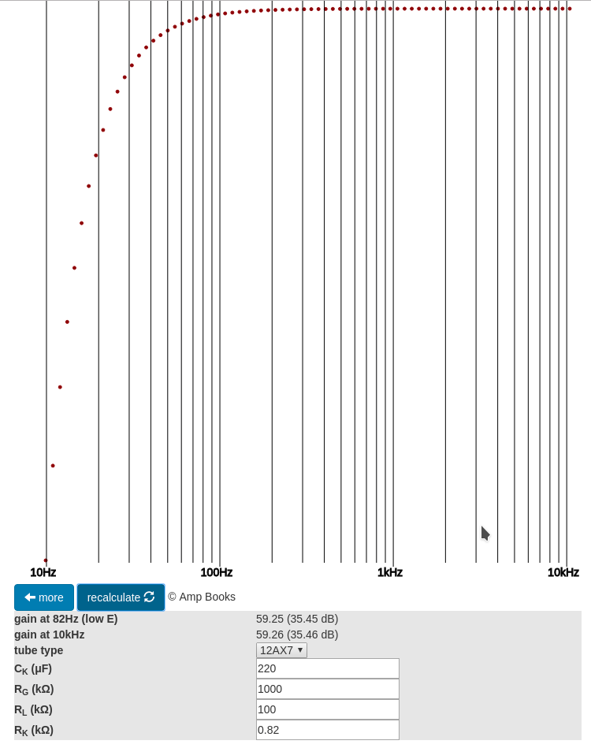

So boosting the low frequencies as much as the highs makes everything sound just buzzy and muddy.  Some [youtubing](https://www.youtube.com/watch?v=wkhmDEKeaBU) I have done lately seems agree that a trebble boost is preferred for good overdrive sounds.

Unwire the old preamp module and install new wires to the tube socket to be ready to assemble the parts when they come in.

## 2019-02-22

* The power supply boards arrived from OSHPark in the mail today. Assemble the components onto a board and install the board into the chassis. Remove the rest of the old ladder circuit.
 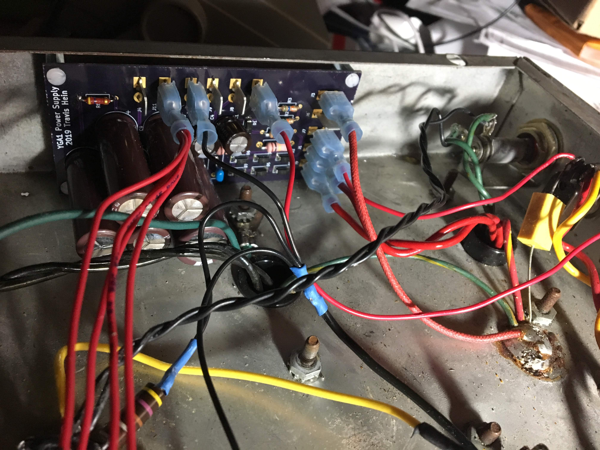

There was a problem where I drew the schematic wrong. The polarity of the 8 uF capacitors was wrong. I put them in the correct way. Fixed the schematic.

I realize as assembling it some of the connection points did not take into account the chassis wired things.

* The second pole of the switch goes straight to the inductor and the centre tap of the output transformer.  The 400V out is also just off the return wire from the choke. So there are three spade connectors not populated here.
* The resistors to the output tubes should have been included on this circuit board.
* There should be more connectors for the 340V outputs. As there are four wires, one to each of the tube modules.

Update the schematic with these changes for next time

This is now all of the original circuit and components. We have modules for everything now.

## 2019-02-13

* Removed the "death capacitor". That 0.05uF capacitor between the mains hot and neutural. Left the switch in the chassis disconnected for now. Watched a bunch of Uncle Doug Youtube channel. He explained a bit that these capacitor and ground select switch are an artifact from before there were three wire ground wires. And I already have good low buzzing sound from the ground chassis.
* Change the configuration of the hot wire to go through the fuze, then to the switch. Instead of the fuze attached to the neutural.
 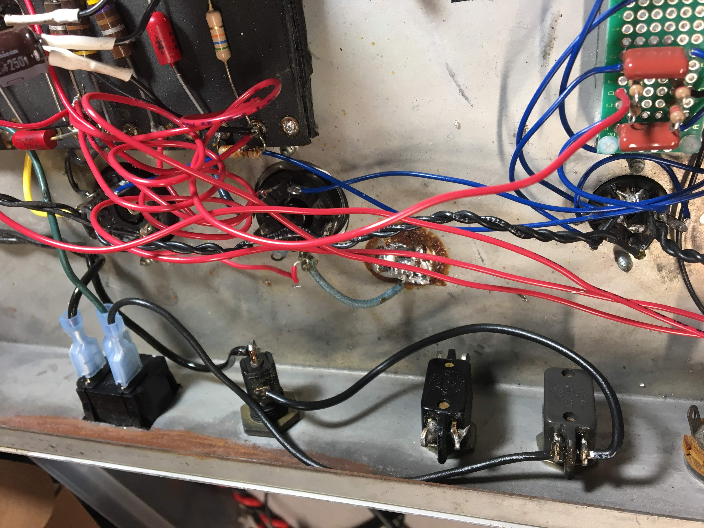
  Using the spade connectors on the IEC connector. The ground wire now goes to a round eyelet connector on a bolt with lock washer, instead of soldered to the chassis. The AC input now feels a lot less whacky to me.
* Updated the schematic for input module.
  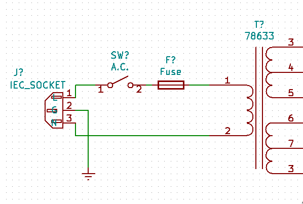
  I started a schematic to have all the parts on one sheet like the original schematic.
* Put some connectors onto the preamp module. Before it was just hard wired in.
 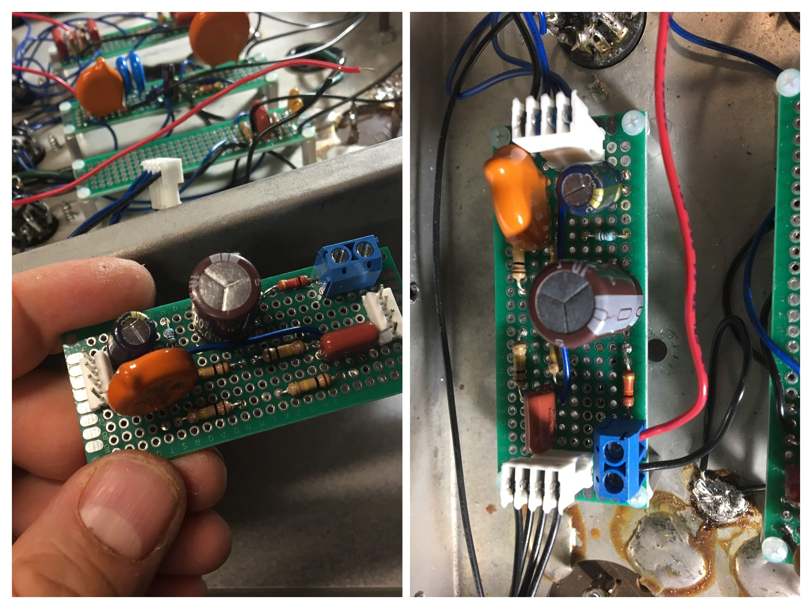
 This will allow me to experiement with different configurations of input preamps. I have some ideas to use both halves of the first 12AX7A tube in series to get overdrive sounds. But not wrecking the original configuration (allowing me to change it out for testing and put it back).

## 2019-02-07

* Replace the output stage with new components and a module.
  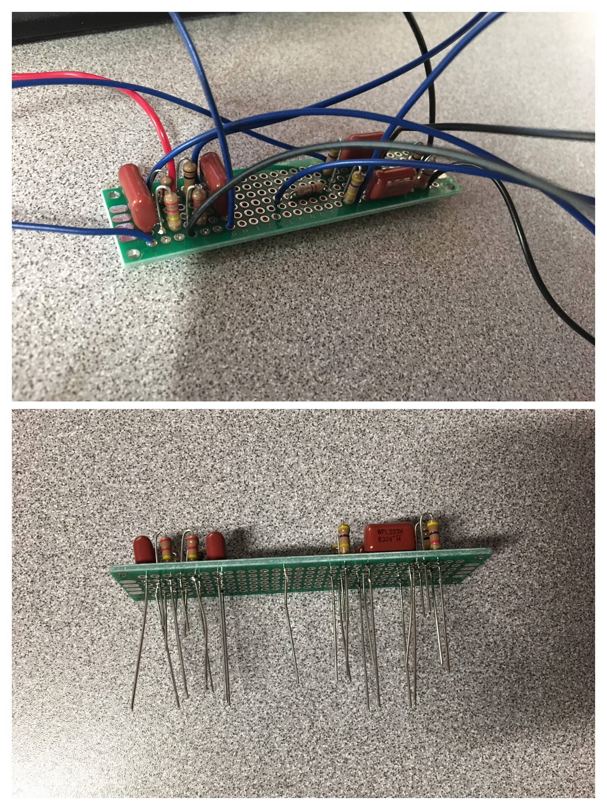
  The only thing left now is the power supply. still waiting for the circuit board to come in from OSHPark.
* Replace the broken 7027 8 pin tube socket with the new one I orded from tubedepot.com.
  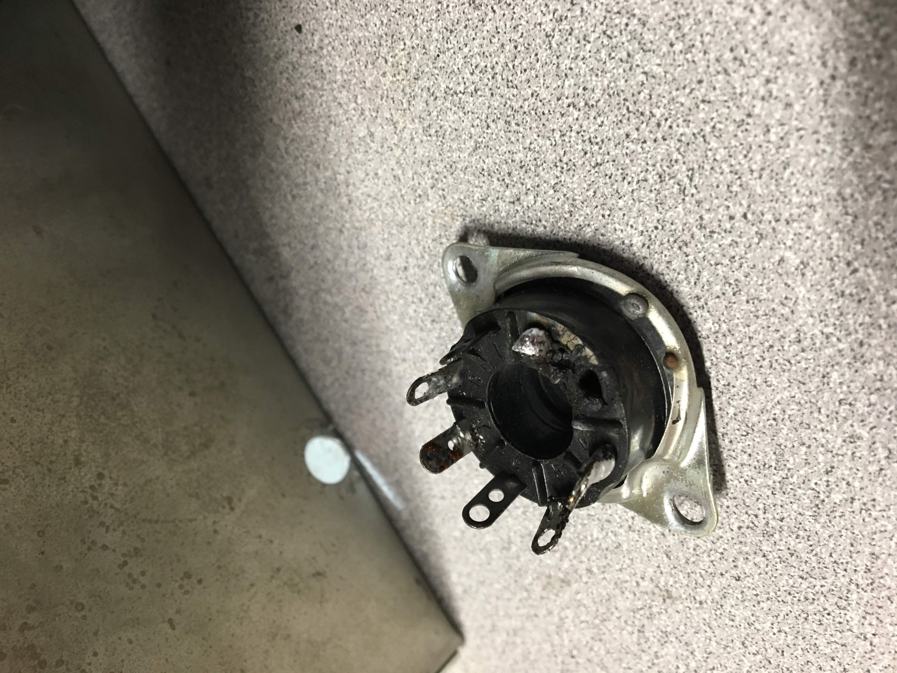

## 2019-02-06

* Build the tremolo circuit onto its own module board. New components of same values. Remove the old components and ladder board to make space.
  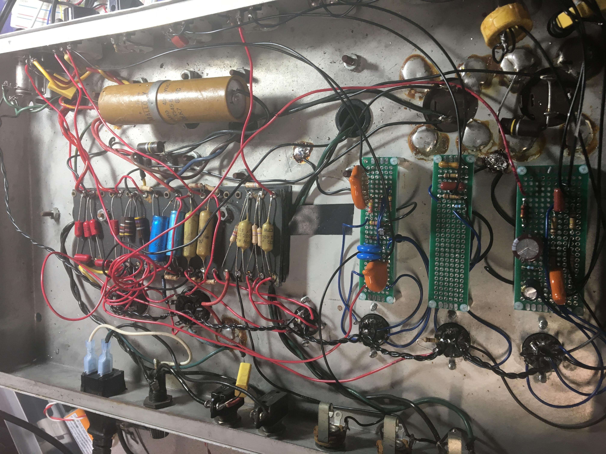
  It is the third from the right (or the left most) green circuit board.

* Parts from TubeDepot arrived today. Had to pay stupid duty at the door. Something to remember. Have new tube sockets to put in sometime. And a new chicken foot knob.
* Install the chicken foot knob. Remove the round knob I had used since i got it as a place holder. Now all knobs are chicken feet. It is a little bit smaller but still of the theme I guess. i knew I should have ordered all new knobs to have them look the same!

## 2019-02-05

* Second order of parts arrived from DigiKey.
* Replace the 0.02uF ceramic capacitor on CH2 with the 0.02uF metal film capacitor. Leave CH1 as ceramic one for now. Wanting to see if I can notice any difference.
* Discover volume knobs are not lined up. The chicken foot handle is not the same orientation on CH1 as CH2. Adjust. I was thinking CH1 had more gain because it shows volume at 0-1 where CH2 needed 1-2.
* I do notice CH2 is still a bit scratchy when changing cables. Likely oxide or dirt on the connectors in the jack.
* Try to clean the input jacks with Q tips and alcohol.
* Notice the chicken foot knobs are super crusty too. Take them all off and clean around them with Q tip and alcohol.
  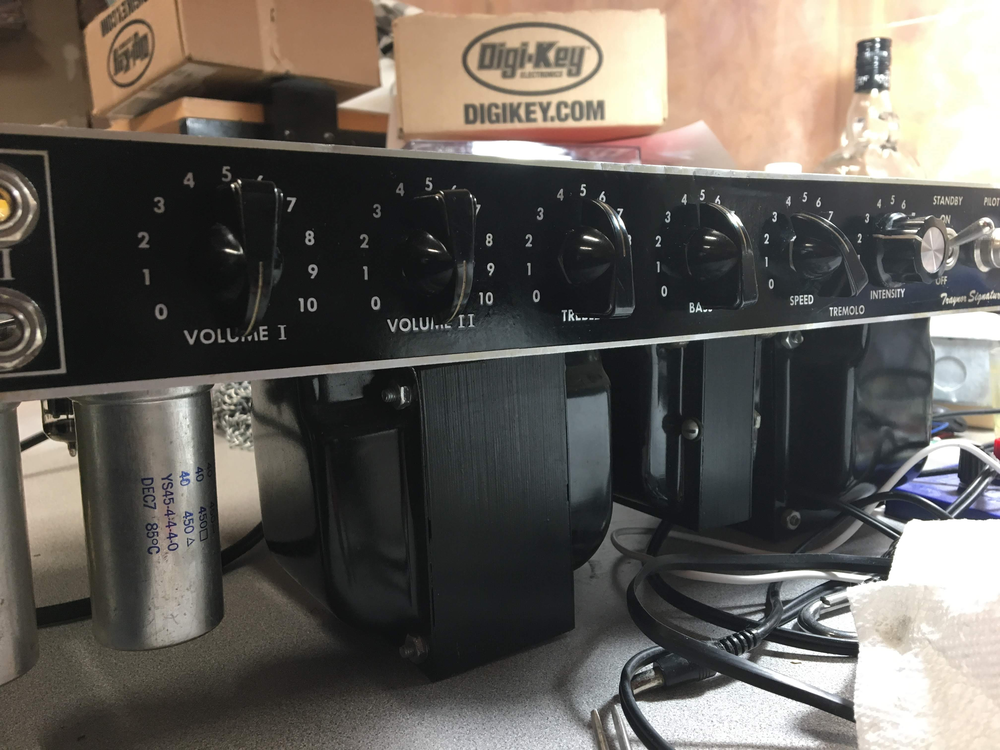
* The cleaning made the treble knob super hard to turn. Like the alcohol got in there I guess and made it sticky. Use a tiny bit of WD-40 on the shaft. Good to go again.
* Replace the ceramic cap I previously put onto the bass knob with a metal film cap. Also replace the resistors now that I have the parts.
  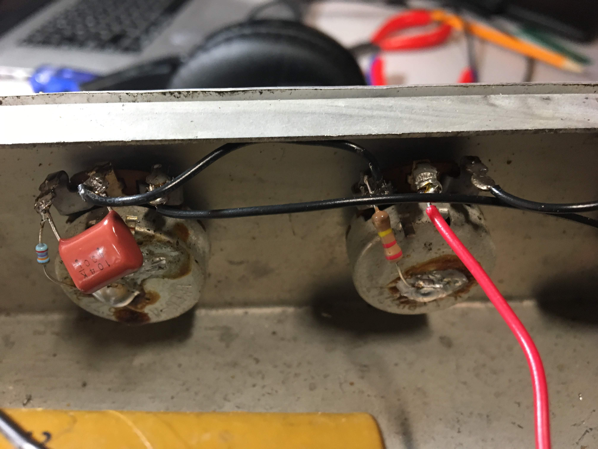
* Build the tone control components onto a circuit board.
  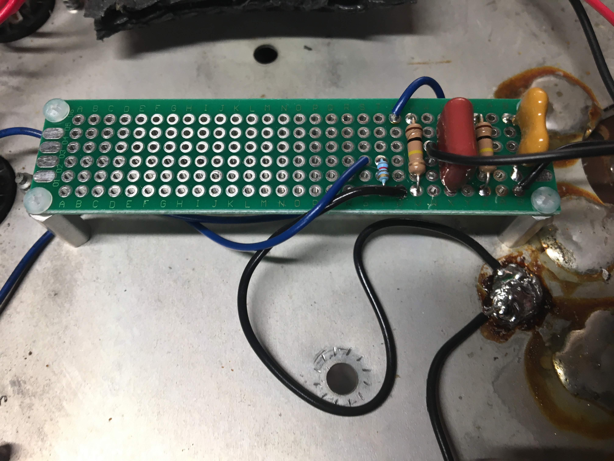
* Now we are at the point of needing to remove some of the original ladder board to make room to mount this.
  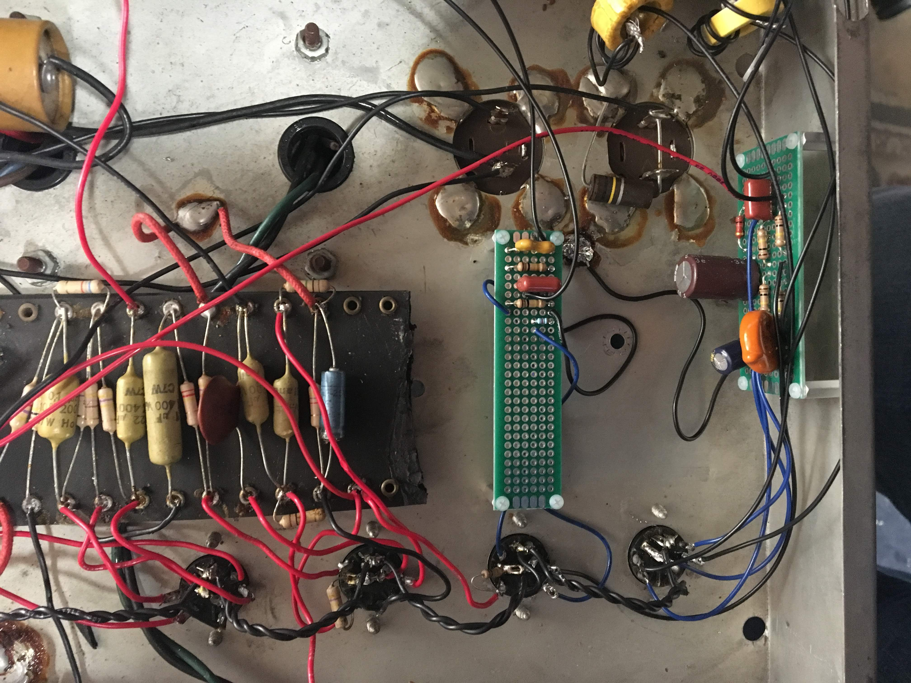
  Also of interest here we can see the metal film capacitor for CH2 on the preamp module.
* Test playing a bit. It continues to sound bright and warm. Have to stop to put the kids to bed.
* Move the preamp module from the side to the bottom.
  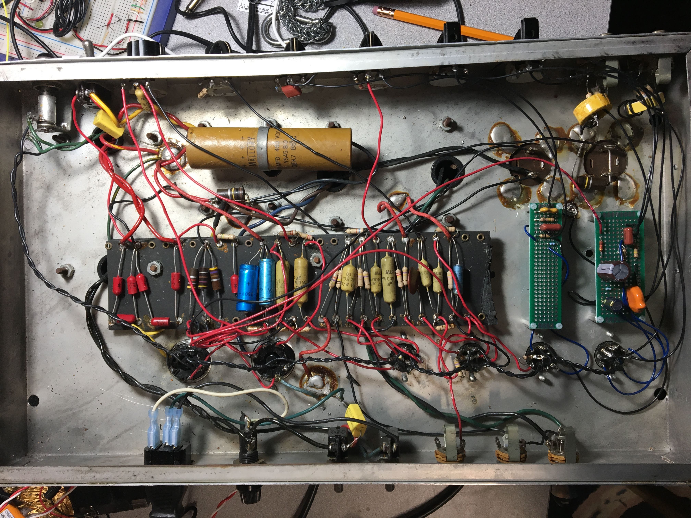
  I was worried sliding it into the case would break the screws on the outside of the metal chassis.
  Also it kind of looks all whacky haing circuit boards all different orientations.

## 2919-02-03

* Install the IEC power connector.

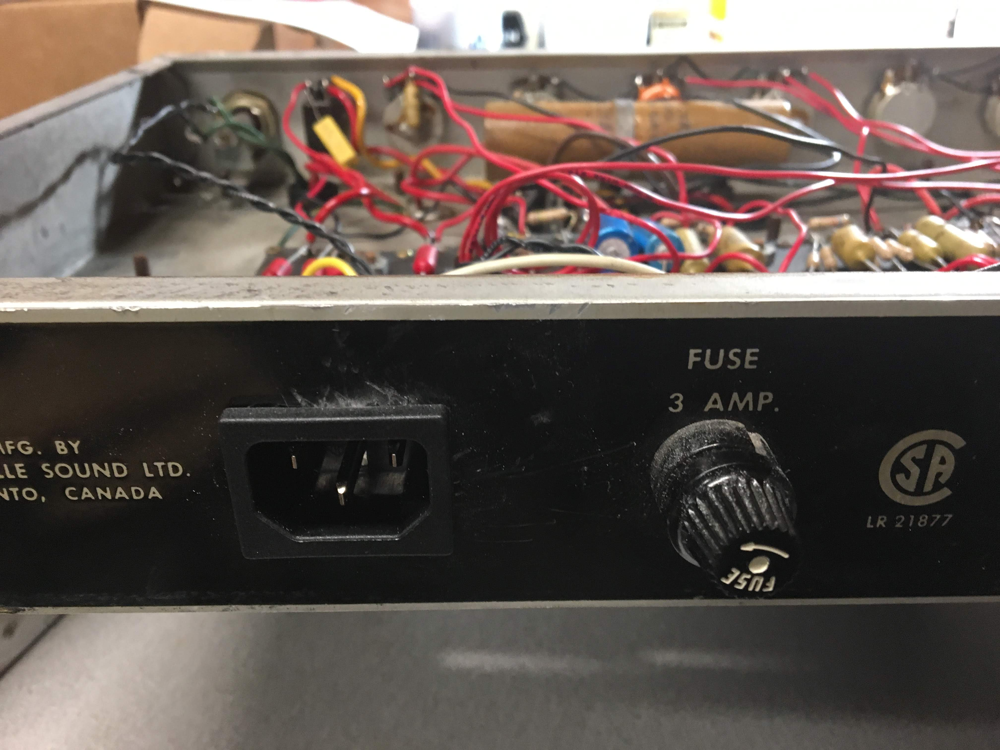

## 2019-02-01

* Review schematic against actual construction in more detail. Discovery the switch was not wired correctly in my amp. Fix it.
* Start an "actual" schematic to compare what is in my amp vs the published schematic, and the individual module schematics I made for learning.
* Organize my thoughts for things to try to hack in a hacking.md file.
* Build a module for the preamp circuits.
* Fix the bass tone stack capacitor on the amp.
* Experiment with capacitor coupled input. I didn't like the sound, undo it.

I disconnected the power transformer from the diodes and hooked up a 12V AC power transformer. Wanting to test to see if there are any shorts in the capacitors. Or if there was any ripple on the DC voltage.

* The inputs to SW3 were wrong. It looks like the DC +V to the output audio transformer and C24 was wired up after the switch, instead of before the switch as it should be. The choke was wired up to the output of the diodes instead of after the switch like it should be. I believe this to be a manufacturing error. It is still functional the same. Only you end up having more of the circuit energized than you should. I fixed this so my amp matches the schematic.
* I now think the drive to the output audio transformer should be on the other side of the switch? I can change this from the circuit board I am planning to make by having the audio transformer center tap connect to the switch where the choke does. This just makes a lot more sense to me to have no high voltage in the circuit when in standby.

Things looked ok so I put the main transformer back in and plugged it in and turned it on. Plugged it into my room speaker and plugged guitar into it.

The amp works. Not nearly as buzzy as I would like it to be.
Some things to look into.

* Volume is scratchy. This is possibly because input jacks are loose still.
* I really don't like that brightness mod on chanel 2 (C3 on the original schematic).
* The 7027A's get pretty hot. It smells like dust burning after it has been on for about 15 minutes.

Turn it off. Put the younger two kids to bed. Come back. Test there is no left over voltage on capacitors. I think R41 and R42 help for this.

* Desolder the C3 tone cap. Discover the wire to the channel 2 volume knob was bad solder joint. That probably will help scratchiness too.
* Discover the C7 on the tone stack, on the back of the bass pot was broken. That is probably why the bass knob wasn't really working. Change this out for one of the new 0.02uF capacitors.

It sounda a lot better. Not as scratchy. And there is a lot of bass response now.

### Preamp input module

Create a small circuit board for the discrete components of the preamp circuit. The green board on the left inside the chassis.

* grid bias capacitor (250uF) and resistor (820 ohms)
* 10K 1W resistor from B+
* 10uF capacitor.
* 2x 100K resistors to the anodes.
* 2x 0.02uF capacitors to volume pots.
* 2x 100k resistors to audio out.

Assemble the circuit board. Using the usual crude point to point soldering on the solder side of the board. Just the leads of the components to each other here.

Screw it to the inside of the case using standoffs and nylon screws. Use 100 watt solder iron to attach ground wire to chassis.
The extra black wire is in case I want to run this over to the power supply board later.

Connect the grid bias capacitor and resistor. Then power up and test. It continues to sound ok. Not broken anyway.

Power it off. Wire up the rest of the resistors and capacitors. Wires going to the 1st 12AX7A tube and the volume pots.
Remove the old parts and wires from the ladder construction.
Placing the wires neatly as close to the chassis as possible, keeping the wires as short as possible as well.

I depopulated the old components from the ladder board. These are those empty rivets on the entire left end of now. I removed 12 components today.

Turn the amp on, plug it into my computer and test it as a speaker for a bit. It isn't catching fire. So thre is that.

Measure the voltage into the 12AX7A again. It now has 0V AC ripple. Before it was 0.2V AC ripple, which was probably why we were hearing the hum on the output. I think the ripple went away because we have the new 10uF capacitor there.

## 2019-01-31

* Adjust board layout to give more spacing between mounting screws from power terminals.
* Submit v1.0 design of power supply board to OSHPark.
* Realize I didn't order enough capcitors. I need 2 more 47uF ones. I also realize one capacitor was missing its footprint on the schematic so did not get onto the board. Now I might have to hack this up, add a capcitor loose with wires or something.
* Fix the schematic to have the missing cap. Also replace the 100uF with 2x 47uF in parallel. This is symetric with the lower end of these.
* Create a schematic in kicad for inputs.
* Analyze the inputs. There is a HI and a LO impedence input.
* Create a schematic in kicad for preamp.
* Analyze the preamp. CH1 has a high-pass filter built into the audio path, but channel 2 does not.
* Create a spreadsheet to inventory the parts in my schematics and reference the original schematic. Also to keep track of what parts I need to order.

## 2019-01-26

* Capture power supply schematic in kicad.
* Add input part of tremolo circuit to the board, since this is 5 discrete components attached to the high voltage AC line from the transformer.
* Order discrete components from DigiKey
