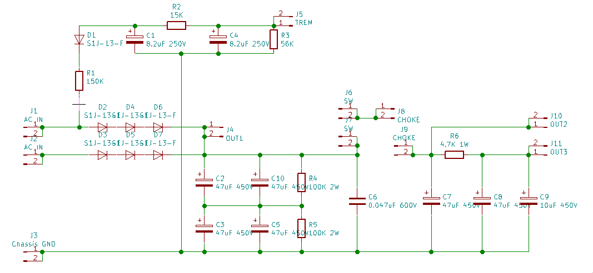
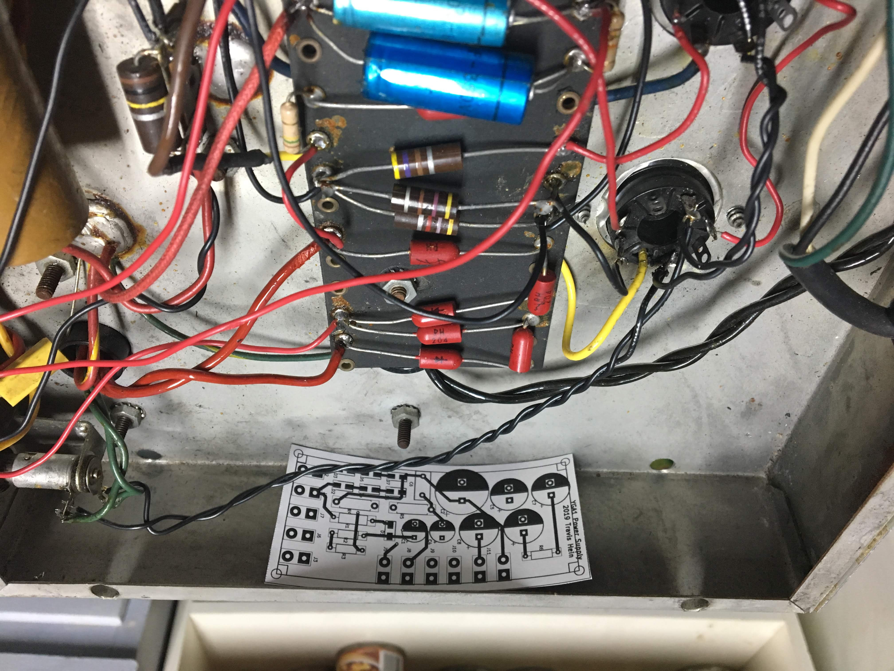
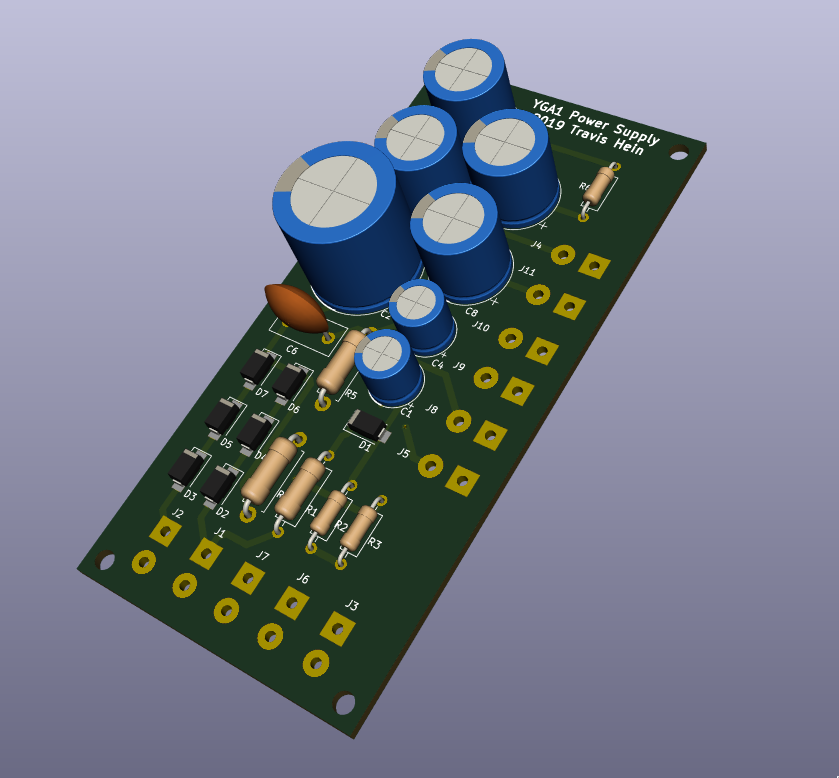
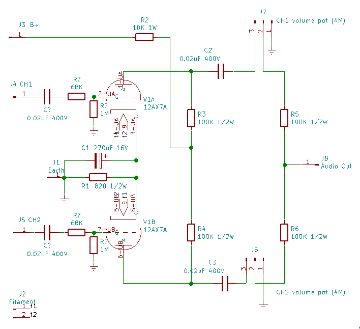

# Hacks and mods

At this point this stuff is only theory. Before and after making each change I would like to power up the amp and listen to it in different modes to see how the change sounds.

And to have some quantative test measurement. Set up a signal generator. Sweep through different input frequencies. Measure the output at different stages.

## Differences from schematic

The schematic I found on the web is not exactly how my amp was built.

* C27 is actually after the 10K 1W resistor in the preamp module area. It is not attached to the C26 40uF in the power supply as the schematic shows it is. I believe this is wired correctly and the original schematic is wrong.

## Power cord

The chassis has a power cord coming out the back of it. The end of the plug is all corroded.

But why have a cord attached to it when the style these days is to use [C13/C14 connectors](https://en.wikipedia.org/wiki/IEC_60320#C13/C14_coupler) to accept an IEC cord.

* Update 2019-02-03: done.

## Power Supply

My first project was to replace the capacitors. But to also not worry about preserving the vintage interior of the things.

The power supply schematic:

Here I included the input part to the tremolo circuit, because it uses the AC line from the transformer with the diode as a half  wave rectifier to create a voltage reference to be passed into the vibrato circuit. It could have gone into vibrato (module). I just wanted to have all of the high voltage things in one spot. Technically this is power supply stuff, as these parts work to provide a -40V source to the oscillator circuit.

The schematic shows those 2 pins per connector because I am using these male metal spade connectors, and this was a hack to have the circuit board render the net list to have me include copper connection to both pins for the connector.

### Voltages

To measure the voltages I turned on the amp and waited about a minute for them to warm up. Initially the voltages were highter but they stabilize once the tubes are loading the circut. No audio input during the measurement.

* After the choke: 400V DC; 3V AC ripple (This ripple is probably because the capacitors are bad?)
* After the 4.7K resistor, B+ into the tone stack and vibrato: 340V DC ; 0.2V AC ripple.
* At the input preamp after the 10K resistor: 216V DC ; 0V AC ripple - this was measured after I replaced the preamp components with modern ones. But there probably was a bit of ripple before, because there used to be a noticable hum in the output before.
* Voltage into vibrato circuit: -40V; 0.2 V AC ripple.

I would think we want no AC ripple anywhere. I will work to replace the capacitors in the power supply.

I designed a circuit board to hold all of the capacitors and resistors and rectifier diodes. This can be made small enough to put off to the side in the case. Here is a paper print out of the board layout.

I can then remove the original components. The idea was to leave the rest of the amp in this original construction.

Working more in kicad to get a 3D model:

## Preamp grid bias fix

After reviewing the [common cathode triode amplifier theory](http://www.aikenamps.com/index.php/designing-common-cathode-triode-amplifiers), I am questioning why the inputs do not have a 0.02uF capacitor to decouple the grid input, and the 1M resistor on the tube-side of the capacitor for grid bias.

Also these 68K input stage [grid resistors](http://www.aikenamps.com/index.php/grid-resistors-why-are-they-used) should be soldered onto the tube socket, not the input jacks. And the 1M grid bias resistor should be on the tube side of the input, which it also is not.

With this in mind, I created a v1.1 of the preamp circuit:

* Added grid capacitor to decouple DC component from input.
* Moved the 1M and 68K resistors from input jack to be soldered onto the tube socket leads (or like super close).
* Removed the 0.001uF tone cap on the Channel 1 signal path. I don't have a need for one channel to sound different from the other channel.

This means the 2 jacks for each channel will go away, We only have a single jack now for each channel. Which is ok really. We never would plug more than one thing into the same channel. And we don't need to have a low/high impedence input.

Testing is needed with effects processor devices. Maybe we keep the two jacks and leave a 68K resistor dividor on the input of the LOW jack,

### Results

I tried this modification.

It sounds ok. There was sound and it was clean. But it had no personality or feel to it. Like there was a bit less gain.

I changed the inputs for channel 2 only. So switching the guitar back and forth to channel 1. the 0.02uF ceramic capacitor I have takes a lot something out of the sound.

Rolling back to the original input for channel 2.

## Preamp input module

Create a small circuit board for the discrete components of the preamp circuit. The green board on the left inside the chassis.

* grid bias capacitor (250uF) and resistor (820 ohms)
* 10K 1W resistor from B+
* 10uF capacitor.
* 2x 100K resistors to the anodes.
* 2x 0.02uF capacitors to volume pots.
* 2x 100k resistors to audio out.

Assemble the circuit board. Using the usual crude point to point soldering on the solder side of the board. Just the leads of the components to each other here.

Screw it to the inside of the case using standoffs and nylon screws. Use 100 watt solder iron to attach ground wire to chassis.
The extra black wire is in case I want to run this over to the power supply board later.

Connect the grid bias capacitor and resistor. Then power up and test. It continues to sound ok. Not broken anyway.

Power it off. Wire up the rest of the resistors and capacitors. Wires going to the 1st 12AX7A tube and the volume pots.
Remove the old parts and wires from the ladder construction.
Placing the wires neatly as close to the chassis as possible, keeping the wires as short as possible as well.

I depopulated the old components from the ladder board. These are those empty rivets on the entire left end of now. I removed 12 components today.

Turn the amp on, plug it into my computer and test it as a speaker for a bit. It isn't catching fire. So thre is that.

Measure the voltage into the 12AX7A again. It now has 0V AC ripple. Before it was 0.2V AC ripple, which was probably why we were hearing the hum on the output. I think the ripple went away because we have the new 10uF capacitor there.

## Tone Control

The tone control in the amp is pretty basic.

I found this neat looking one http://www.angelfire.com/electronic/funwithtubes/Amp-Tone-A.html#Amp-Tone_Control-3-A-back
More discrete parts. I would need a way to make the tone control modular. To swap out the original  ones with a new one. But I don't see how to do this in this chassis. This mighe be a good project for a new amp design.

## Effects Loop

There is no convenient way to connect the GSP1101 effects processor to this amp using the 4 wire method because there is no effects loop. All I can do now is have the guitar go into the GSP1101 and then the output of the GSP1101 go into the amp inputs.

More thought is needed if we need  this.
I think, yes. because if we want to have the preamp overdrive things to have tube distortion, but have reverb added after the preamp from an effects loop.
