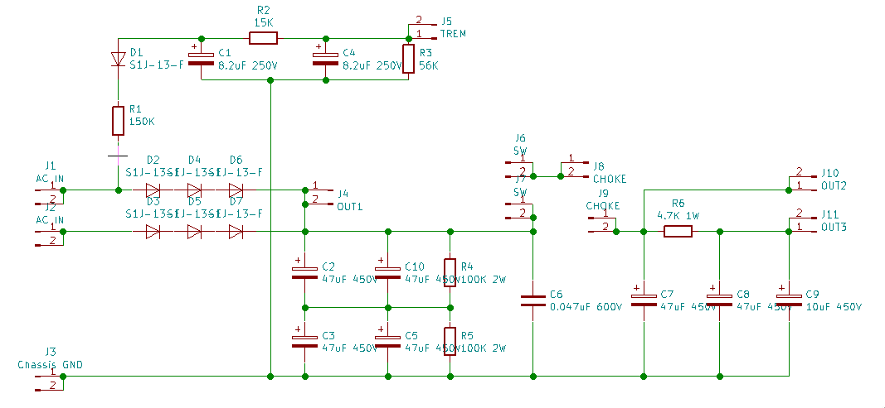

# Traynor YGA1 Guitar AMP

I had this from many years ago.

I got it from Rick Watt's nephew, Chris. It had caught fire and burned. The original wires were those 1960's cloth kind of insulation.

I did not understand vacuum tube electronics in depth. Other than they were metal in glass. No moving parts or semiconductors here. Just resistors and capacitors. If I replace all the burnt wires it should just work again right?

I used modern wires (for 1990's) to rewire it.

A tube socket was missing a pin so I made a loop of wire and jammed it into the hole. Close enough.

The amp worked for a while for me. I used it mostly with that Kramer guiter I custom painted to look like Franken Strat. It just sounded good.

I think this was before I had the Boss ME-10, so I used it with discrete effects pedals to get the tone. And the built in tube tremolo feature was cool sounding.

Recent research shows these amps are [basically indestructable](https://reverb.com/ca/news/a-guide-to-vintage-traynor-amps).

I moved away for internship and never returned home. My mom had it burried in the clutter at the house. She passed away, her friend Sandy who handled the estate shipped it to me.

But this is now 20 years later. Now that I am aware of old devices with the old paper style capacitors becoming electrically "leaky" I am afraid to even plug it in, thinking there could be a short and it would just burn the power transformer. Or something else would catastrophically fail.

Looking at the wiring I am a bit uneasy with the high voltage DC wires right there beside the input high impedance wires. The old point to point or ladder circuit construction is a lot different than anything I would consider to be a safe design today.

## Ethics

Do we maintain everything as "all original", preserving the vintage electronics style of the day (the ladder construction).

Or do we create a modern PCB modules, connectors.

Or something in between.

I was amused with the [ship of Theseus](https://en.wikipedia.org/wiki/Ship_of_Theseus) thought experiment here.

At what point does it matter to continue to use this same chassis. I could go all the way and order new power transformer, choke, output transformer, tube sockets, tubes, and discrete components and build a fresh new amp on a new chassis.

Reading into the history of [Traynor amplifiers](https://en.wikipedia.org/wiki/Traynor_Amplifiers). They were originally hacked together by a tech at Long and McQuade to be a cheaper option for their equipment rentals. So less expensive but good enough.  Do I really want to build based on this? Or should I learn what a high end amp design looks like.

In any case at this time I really do not need to mass produce tube amplifiers. Even if I could get good prices on the components, there is no compelling reason to build one as it is at least as expensive as buying one already made and well packaged.

The amp was labelled as "ideal for modifications". It is in the herritage. And being a Canadian, I feel very special to have a piece of Canadian music history to play with.

And then some discussion from [Mr Carleson's Lab](https://www.youtube.com/watch?v=7VBVSEevXaY) sais to replace all the old capacitors, because they are all basically garbage when they age. And this will hurt the reliability of the amp over time.

Since this amp was created to be a regular amp at the time, and is kind of in rough shape. I think I will do my best to make it look nice on the outside (new chicken foot dial).

But for the inside I will replace the power supply circuitry with updated construction.

## Inputs

This amp has 2 input channels. They are mixed after the first preamp stage.

Each input has 2 1/4" mono audio Jacks. They are configured as

Some thinking about this:

If we plug something into only J1:

* R1 is removed from switch on J2
* Signal is 1/2 of input because of R2, R3 resistor divider.

If we plug something into J2 only:

* R1 is in use.
* R2 is connected in parallel to R3, because switch in J1 is closed.
* Vo = 1M / (1M + 32K) or 97% of input voltage.

So here J1 is a "LO" inpedience, or line input, and J2 is a "HI" impedience, like microphone.

In our Amp, I put the HI inputs on the bottom.

## Preamp

The preamp stage uses a single 12AX7A, one half for each input channel.

This configuration is what is referred to as a [common cathode triode amplifier](http://www.aikenamps.com/index.php/designing-common-cathode-triode-amplifiers).

* We can see Channel 1 has the extra 0.001uF capacitor in parallel with the volume potentiometer. This will have the effect of a high-pass filter, or at least it will cut out a lot of the lower frequecies.
> This is actually channel to. At this time when reading the schematic, the top channel I assumed to be channel 1, but on the chassis it is labelled as Channel II.

## Tone

The tone control circuit uses a 12AX7 as another intermediate amplifier stage. I do not know at this time how to compute the gain here.

It passes the signal through a RC network apparently called a "tone stack".

## Power Stage

Here a 12AX7A is used as a buffer to mix the audio imput with the feedback from the output transformer.

This is apparently called a push-pull amplifier.

The 7027A tubes are used here because they are higher power versions of the 6L6 tubes.

The 6L6 tubes are beam power tetrodes. They were created to circumvent patents in the pentode design. So beam power tetrodes have the function of penodes, but have a lower transimpedience, which works to make them more linear and have less distortion.

The output from the 7027A tubes is high impedence, so these feed the windings of an audio transformer. Because of the push pull design, the transformer center tab is connected to B+.

In hindsight I should have placed the beam power 4.7K resistors onto the power supply module.

* It drives the two 7027A through a capacitve coupling.
* The input from the tremolo oscillator circuit is mixed in.
* Why is R8 100K when R7 is 82K?  The small difference here of 18K?

## Vibrato

The vibrator uses a low frequency oscillator to modulate the audio in the power stage.

* I actually put R1 onto the power supply board too.

This looks a bit like this schematic from [popular electronics](http://www.rfcafe.com/references/popular-electronics/build-your-own-vibrato-dec-1957-popular-electronics.htm)

## Power Supply

This is a linear power supply with DC smoothing capacitors and a choke, but no regulation.

The power supply produces about 400V DC at the output of the diode rectifier.

The voltage that gets to the anode of the 12AX7A in the preamp stage is about 320V

* Why in this schematic is the power to the output audio transformer not after the standby switch. As it is in the original schematic this means the tubes would still be live when in standby with power on.
