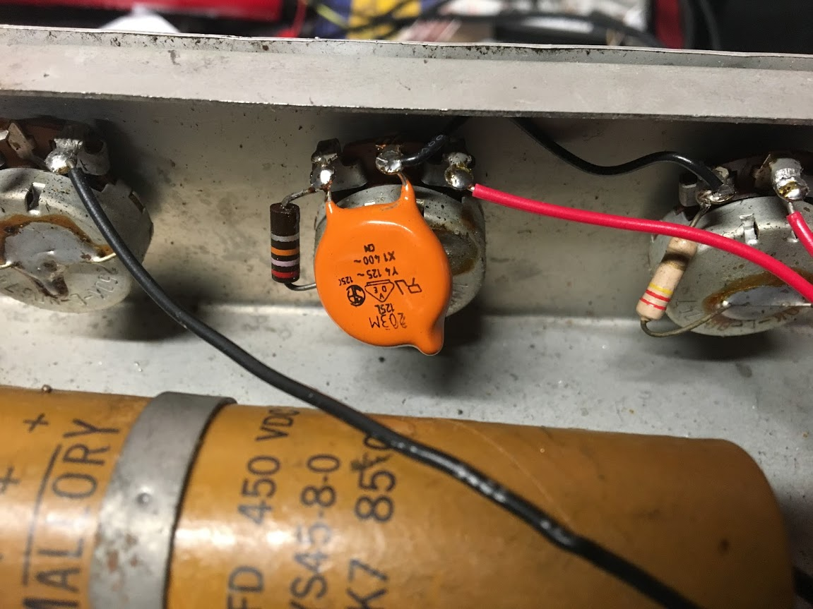

# Status Log

This is the documentation of the amp state.

## 2019-02-01

I disconnected the power transformer from the diodes and hooked up a 12V AC power transformer. Wanting to test to see if there are any shorts in the capacitors. Or if there was any ripple on the DC voltage.

* The inputs to SW3 were wrong. It looks like the DC +V to the output audio transformer and C24 was wired up after the switch, instead of before the switch as it should be. The choke was wired up to the output of the diodes instead of after the switch like it should be. I believe this to be a manufacturing error. It is still functional the same. Only you end up having more of the circuit energized than you should. I fixed this so my amp matches the schematic.
* I now think the drive to the output audio transformer should be on the other side of the switch? I can change this from the circuit board I am planning to make by having the audio transformer center tap connect to the switch where the choke does. This just makes a lot more sense to me to have no high voltage in the circuit when in standby.

Things looked ok so I put the main transformer back in and plugged it in and turned it on. Plugged it into my room speaker and plugged guitar into it.

The amp works. Not nearly as buzzy as I would like it to be.
Some things to look into.

* Volume is scratchy. This is possibly because input jacks are loose still.
* I really don't like that brightness mod on chanel 2 (C3 on the original schematic).
* The 7027A's get pretty hot. It smells like dust burning after it has been on for about 15 minutes.

Turn it off. Put the younger two kids to bed. Come back. Test there is no left over voltage on capacitors. I think R41 and R42 help for this.

* Desolder the C3 tone cap. Discover the wire to the channel 2 volume knob was bad solder joint. That probably will help scratchiness too.
* Discover the C7 on the tone stack, on the back of the bass pot was broken. That is probably why the bass knob wasn't really working. Change this out for one of the new 0.02uF capacitors.

It sounda a lot better. Not as scratchy. And there is a lot of bass response now.

### Preamp input module

Create a small circuit board for the discrete components of the preamp circuit. The green board on the left inside the chassis.

* grid bias capacitor (250uF) and resistor (820 ohms)
* 10K 1W resistor from B+
* 10uF capacitor.
* 2x 100K resistors to the anodes.
* 2x 0.02uF capacitors to volume pots.
* 2x 100k resistors to audio out.

Assemble the circuit board. Using the usual crude point to point soldering on the solder side of the board. Just the leads of the components to each other here.

Screw it to the inside of the case using standoffs and nylon screws. Use 100 watt solder iron to attach ground wire to chassis.
The extra black wire is in case I want to run this over to the power supply board later.

Connect the grid bias capacitor and resistor. Then power up and test. It continues to sound ok. Not broken anyway.

Power it off. Wire up the rest of the resistors and capacitors. Wires going to the 1st 12AX7A tube and the volume pots.
Remove the old parts and wires from the ladder construction.
Placing the wires neatly as close to the chassis as possible, keeping the wires as short as possible as well.

I depopulated the old components from the ladder board. These are those empty rivets on the entire left end of now. I removed 12 components today.

Turn the amp on, plug it into my computer and test it as a speaker for a bit. It isn't catching fire. So thre is that.

Measure the voltage into the 12AX7A again. It now has 0V AC ripple. Before it was 0.2V AC ripple, which was probably why we were hearing the hum on the output. I think the ripple went away because we have the new 10uF capacitor there.