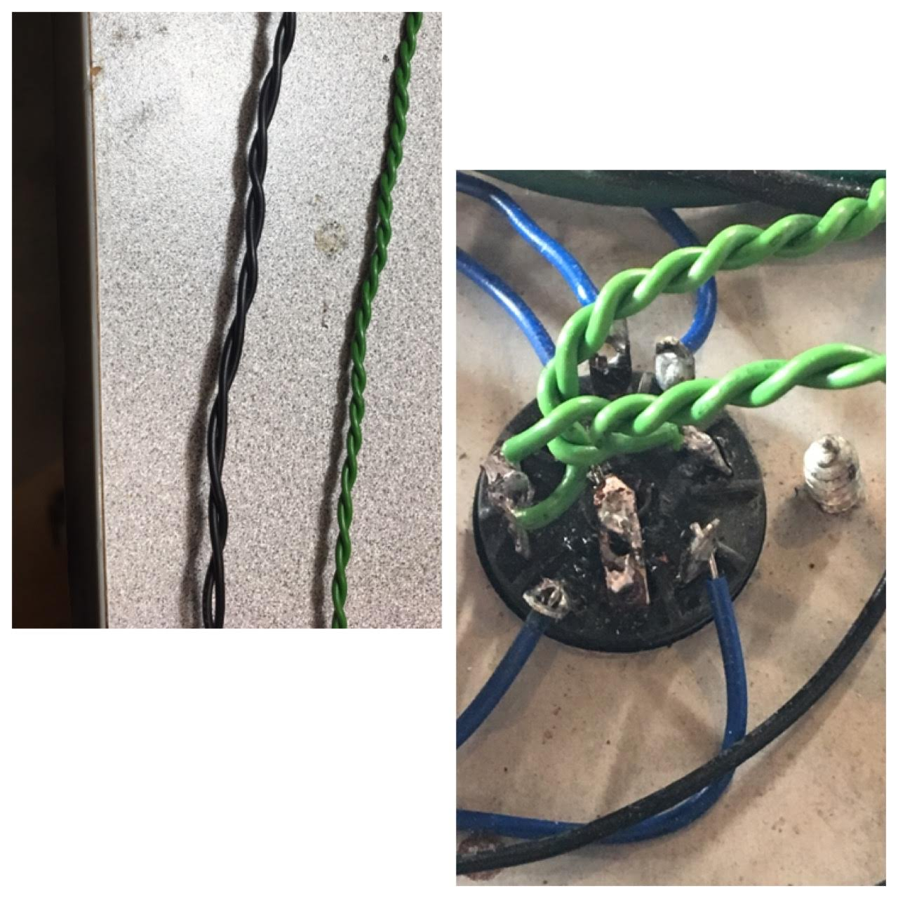
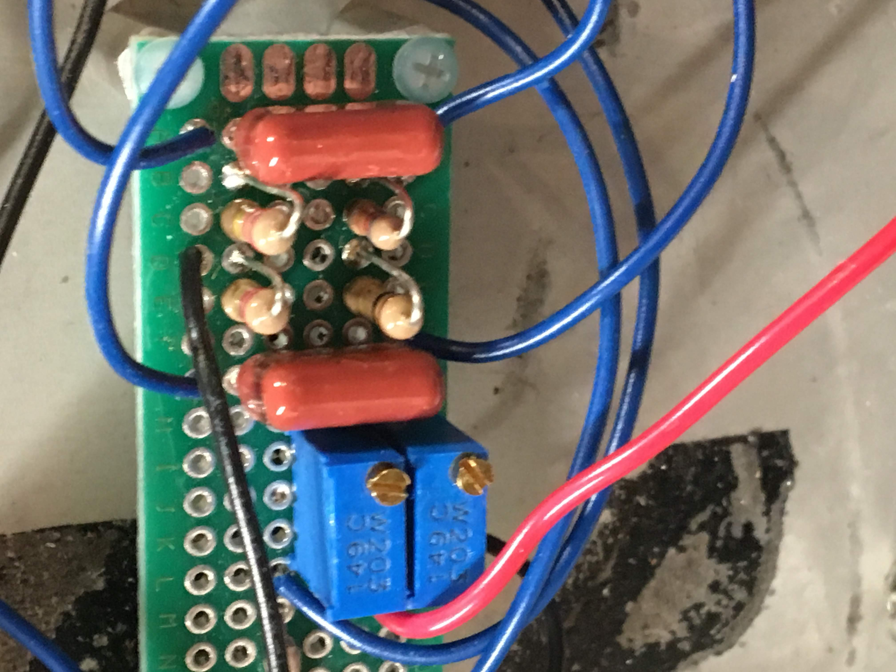
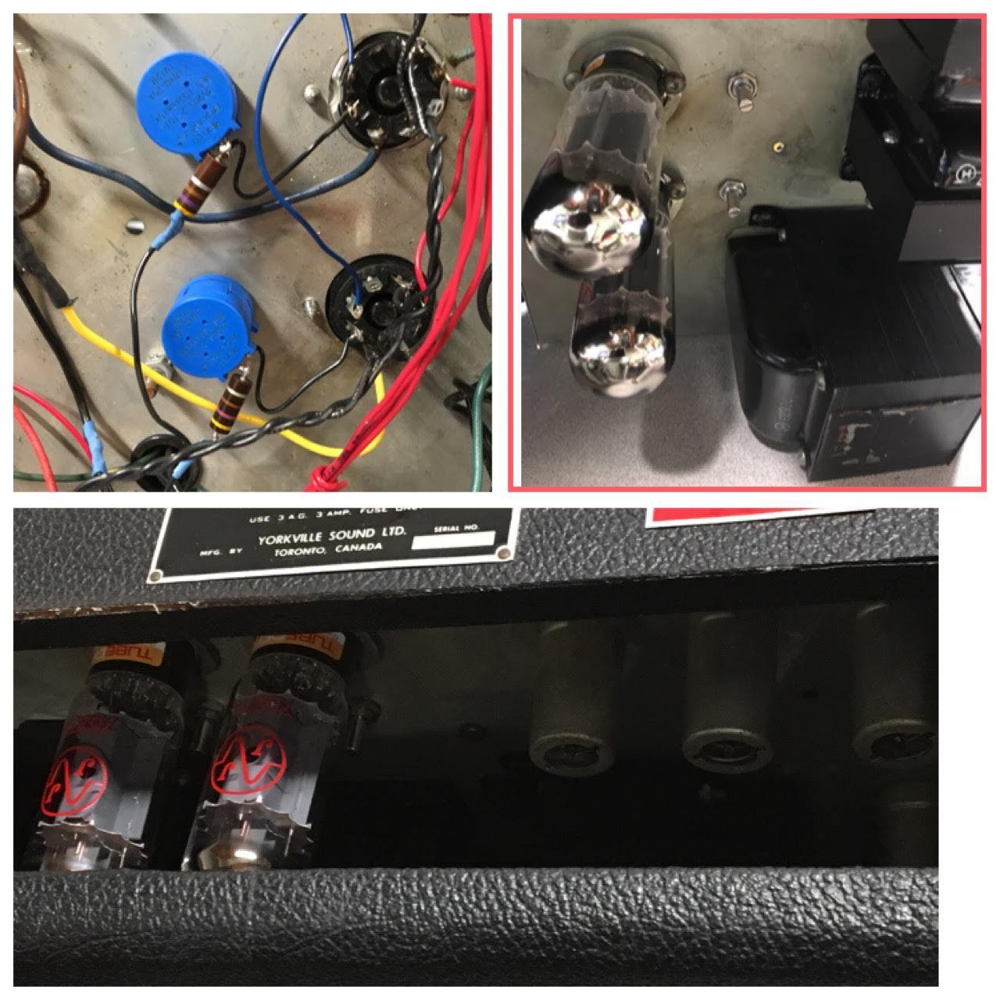
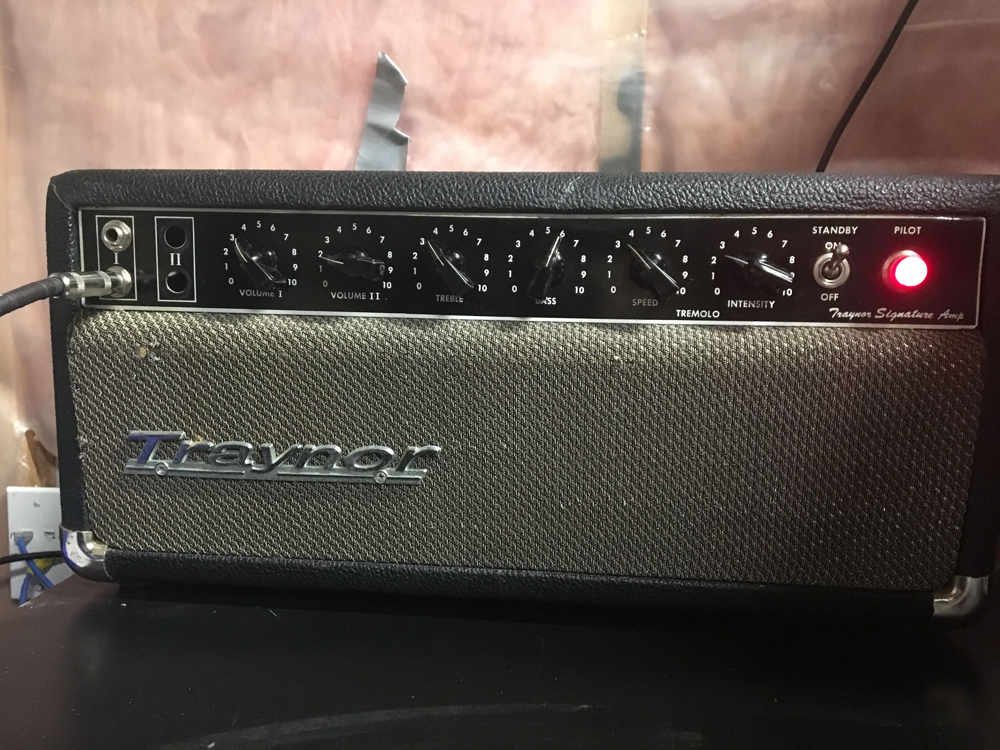
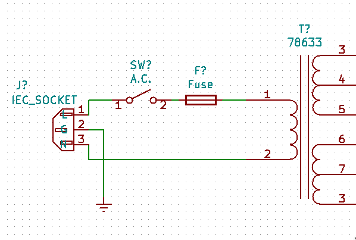
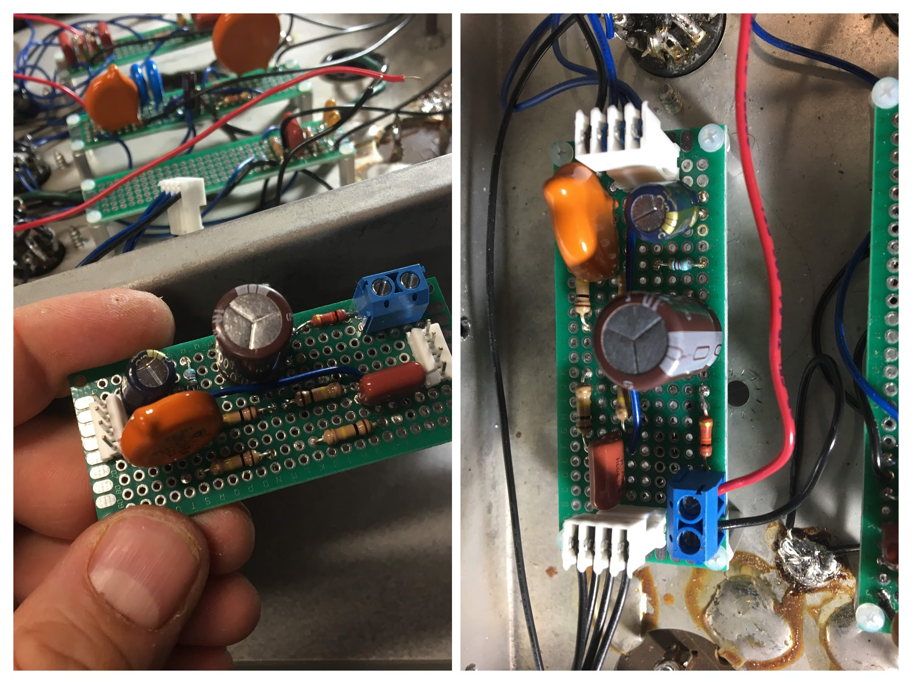
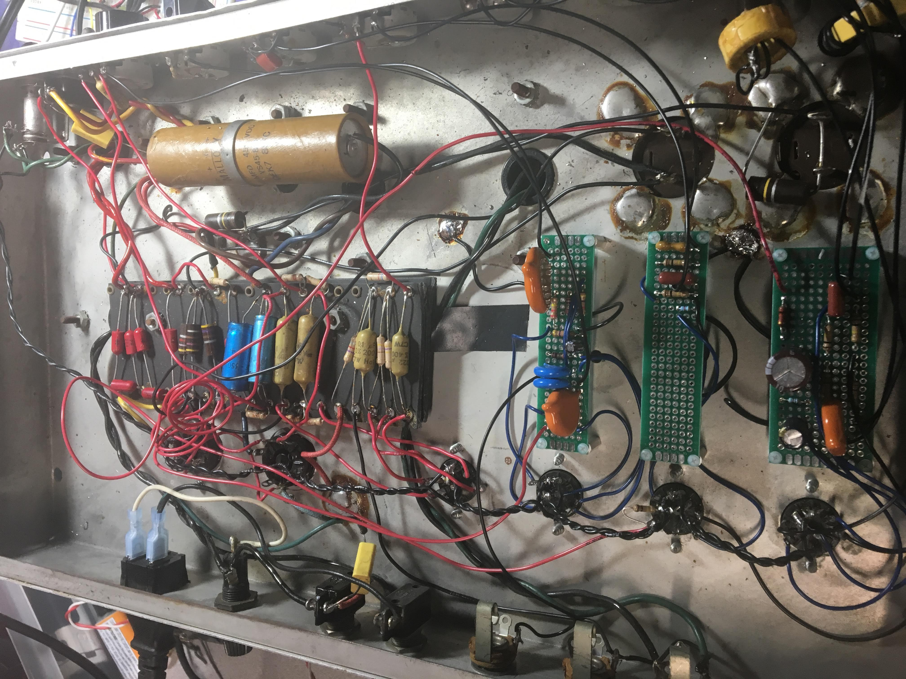
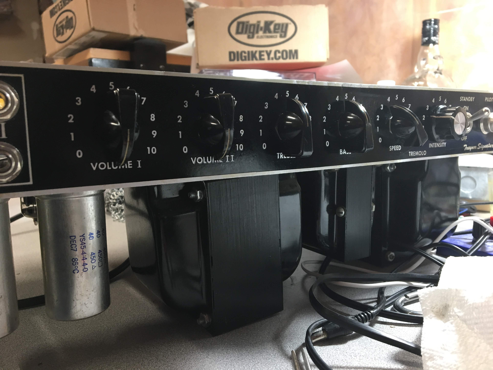
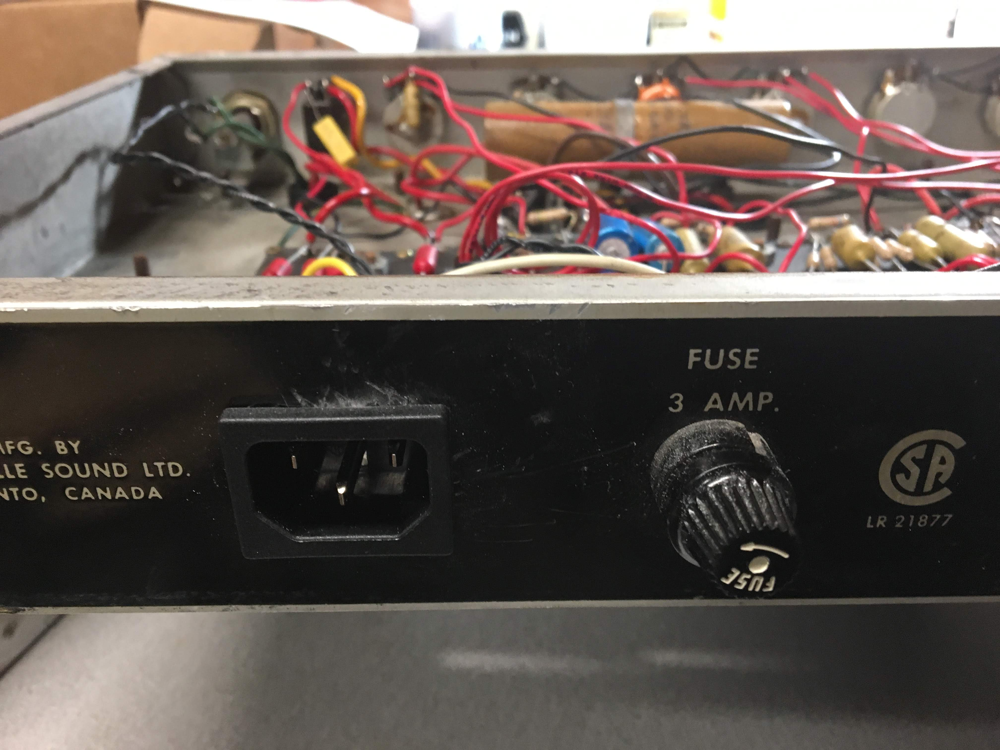

# Status Log

This is the documentation of the amp state.

## 2019-11-23

I am still getting a bit of hum in the background. And turning up the tone knob increases the hum. This kind of hints to me the problem is before the phase splitter right.

A [post](https://www.reddit.com/r/DIYGuitarAmps/comments/e0a04w/trying_to_match_a_pair_of_7027_power_tubes_adding/) I put on Reddit, comments say to try to put in a virtual ground in the heater supply with some resistors.

Reading up on [heater wiring](http://www.valvewizard.co.uk/heater.html) from the Valve Wizard site. This seems to be a good thing to do.

* I was happy to attempt to create a virtual ground with 2x 220 ohm resistors across the fillament supply to ground.
* But the fillament supply is center tapped off the transformer, and grounded. We can see this on the schematic too.

I had the idea. Maybe the fillament wiring I did in the 1990s is not as brilliant as it could be. I did not rewire the fillaments this round when I restored the amp because they still worked. But there are some places where they are not as tightly twisted as they could be. Replacing these with stranded wire I now have. (It was that solid wire before)

I wired it up with better twisted wires and more twists closer to the tube sockets.

I placed separate wires for the power tubes and the 12ax7 tubes, in case the hum was still there, because my next test would be to try a DC fillament power supply.

The black wires are the original wiring I did in the 1990's. The green ones are the ones I put in today. Much better twist using stranded wire instead of solid wire. And the twists go all the way up to the tube.  I guess I did not know any better before when I first fixed this. Oddly I made the mistake of not rewiring the filaments when I rebuilt it this time around, as I thought they were still ok and good. But no!  Lesson learned here is fillament wires need to be very well twisted and very short parts that are not twisted by the tube socket.

I also noticed I had two Ruby tubes in there, for the tone stack. I have a feeling the Ruby tubes are basically rebranded China tubes. or are at least not as good as JJ tubes.

The tubes now

* preamp: Sovtek 12AX7
* tone stack: JJ ECC83
* tremolo: JJ ECC83
* Phase splitter: JJ ECC803 (longer plates, slightly lower gain.)

The amp now has very little hum. I would say less than my Hughes and Kettner Grandmeister 40 amp. There is a very slight buzz or hiss when the treble is cranked up and high volume. but this is probably regular. It is not distruptive of the sound or play quality anyway.

Very happy with the sound and feel of it now.

Take off
## 2019-11-22

I was thinking based on my experience from fixing my YBA-300 bass tube amp recently, how they use OP-AMPs for the phase splitter, how having a wonky or not working as well as it should OP-AMP can really influence the performance of the phase splitter, and thus producing awful amounts of hum.

That if the hum I am getting sometimes comes and goes, and the changing the phase splitter tube out as I did before can make a difference, maybe the tube phase splitter here is not working perfectly.

I had the idea to put in trimmer potentiometers in series with the positive supply resistors, so I could adjust the resistance to be more what it was supposed to be.  I found the 82K resistor was actually 79K and the 100K resistor was actually 98K or thereabouts.

I also put in some 2W 100 ohm potentiometers in series with the 470 ohm resistors to the screens on the 7027 tubes, So these could be fine tuned as well. In the process I discovered one of the 470 ohm resistors was actually about 650 ohms. This is way off where it should be. Thes two resistors are the last of the original resistors, since at the time I forgot to order them when I rebuilt the amp. I guess I thought, "it is probably fine" and kept using them, but I never actually measured them. They have always been off too though, for the life of the amp. So not entirely sure how important the current or bias to the screens on the power tubes is for reducing hum here.  But it is fun to explore this. I now will be ordering new 470 ohm resistors.

I think the idle hum is a little better, but is still there when turning up the treble on the tone stack.

## 2019-10-25

Playing using the amp. Notice there was some random "run away" buzzing sounds. The buzz would be noticably effected when tremolo was on. So it was probably not in the power stage, but something before the power stage.

I had been using "China" tubes for all the 12AX7 positions. Maybe this was effecting the stability of the the amp?
Replacing the phase splitter with a good JJ tube and the random buzzing went away a bit.

## 2019-02-28

I changed out the preamp tube with one I had in my electronic junk bin. This one has slightly shorter plates. For what ever magic ass reason this other tube does not have the high frequency oscillations. I notice a bit more hiss and background noise like hum and crackles when the first gain is higher. I think perhaps trying different preamp tubes. I have some coming in from aliexpress. So wait and see. Maybe some good expensive ass one from tubedepot if that doesn't help. I hate the shipping though.

Changed out the 7027 tubes for a new set I ordered from tubedepot before. The new ones are a bit taller. So i can't have it mounted on my desk out of its case anymore I guess.

The new tubes are super shiny. And seem to operate not quite as hot as the old ones. I don't have any setup to check or adjust their bias. But they sound ok. And subjectively they both seem to get the same amount of hot, so not having one loaded harder anyway. Probably.

Decide the sound of the amp is good enough. It works. It plays very brightly. Sounds good for both guitar and bass guitar. Really to improve it more I would need some better speakers. I just have shitty old home stereo system "house party" speakers. Good enough for making noise when people don't care, but not a good speaker at all. When I can stop tinkering with the electronics in the amp I can focus on practicing to make music more too.

Put it back together in its chassis for now. Clear off a spot on a table for its new home.

## 2019-02-27

DigiKey parts came. Happiness!

Assemble the preamp module

Get it wired in nicely. Try it out a little bit (but it was after kids in bed so not very loud or long).
I just plugged the guitar directly into it.
It is a lot tinnier sounding, less whole bass sounding it was before. But I have a lot of variation with the tone controls on the amp and on the guitar.

I was able to get some crunchy overdrive sounds. I noticed the volume pot is a little scratchy. And there is a weird spot where it seems to be some kind of resonant spot. You hear it sort of cut out and very high pitch hiss.  I have theory this is because the pots are 4M and not the 500K the schematic called for. I just used the ones that were on the chassis, but maybe I should have replaced them. Something to add to the next digikey order. In the mean time I will try to play with this a bit and see if I can find some good settings from it.

## 2019-02-26

Have the idea to replace the preamp circuit with one based on the [AX84 High Occtane](http://www.ax84.com/hioctane.html) amp.

Here I am just replacing the preamp part, up to the cathode follower before the tone stack.

It will

* Replace the preamp module board.
* Remove the channel II input.
* Add a 1 uF capacitor to the cathode of the tone stack cathode follower.
* The 0.68uF capacitor on the first stage of the preamp
* The 1 uF capacitor onthe second stage.

We will lose the two separate input channels. But I don't need thse anyway. The second channel becomes the second stage in this new single channel. The existing volume knob on the front of the chassis is thus used. We will have holes where the channel II inputs used to be.

The attempt to use a connector on the preamp module before to connect to the tube does not work.

* This did not consider the separate wire for each cathode. Before both cathodes shared a single resistor and bypass capacitor. But these now are differnt.
* It did not consider the second grid input, which used to be directly wired to the input jack.

No matter. Removing and replacing the module is still the order of changing 6 wires. If we ever decide this mod is not useful and wanted to go back to the original configuration we can just rewire up the old preamp module.

I need to 16 resistors and capacitors. Of course I do not have all of these. Place a DigiKey order.

I think this will have a higher amplification for higher frequencies, providing a treble boost type of effect.
Based on the [cathode bypass calculator](https://www.ampbooks.com/mobile/amplifier-calculators/cathode-capacitor/calculator/)

The second stage has a similar curve, with the (1uF,1.2K) cathode bypass, but with a 83Hz gain of 36 instead of 27.

I believe this is why it sounded bad before when I experimented connecting the first stage of the two channels together in series. The configuration of the Traynor preamp is pretty flat amplification over all frequencies.

So boosting the low frequencies as much as the highs makes everything sound just buzzy and muddy.  Some [youtubing](https://www.youtube.com/watch?v=wkhmDEKeaBU) I have done lately seems agree that a trebble boost is preferred for good overdrive sounds.

Unwire the old preamp module and install new wires to the tube socket to be ready to assemble the parts when they come in.

## 2019-02-22

* The power supply boards arrived from OSHPark in the mail today. Assemble the components onto a board and install the board into the chassis. Remove the rest of the old ladder circuit.
 

There was a problem where I drew the schematic wrong. The polarity of the 8 uF capacitors was wrong. I put them in the correct way. Fixed the schematic.

I realize as assembling it some of the connection points did not take into account the chassis wired things.

* The second pole of the switch goes straight to the inductor and the centre tap of the output transformer.  The 400V out is also just off the return wire from the choke. So there are three spade connectors not populated here.
* The resistors to the output tubes should have been included on this circuit board.
* There should be more connectors for the 340V outputs. As there are four wires, one to each of the tube modules.

Update the schematic with these changes for next time

This is now all of the original circuit and components. We have modules for everything now.

## 2019-02-13

* Removed the "death capacitor". That 0.05uF capacitor between the mains hot and neutural. Left the switch in the chassis disconnected for now. Watched a bunch of Uncle Doug Youtube channel. He explained a bit that these capacitor and ground select switch are an artifact from before there were three wire ground wires. And I already have good low buzzing sound from the ground chassis.
* Change the configuration of the hot wire to go through the fuze, then to the switch. Instead of the fuze attached to the neutural.
 
  Using the spade connectors on the IEC connector. The ground wire now goes to a round eyelet connector on a bolt with lock washer, instead of soldered to the chassis. The AC input now feels a lot less whacky to me.
* Updated the schematic for input module.
  
  I started a schematic to have all the parts on one sheet like the original schematic.
* Put some connectors onto the preamp module. Before it was just hard wired in.
 
 This will allow me to experiement with different configurations of input preamps. I have some ideas to use both halves of the first 12AX7A tube in series to get overdrive sounds. But not wrecking the original configuration (allowing me to change it out for testing and put it back).

## 2019-02-07

* Replace the output stage with new components and a module.
  
  The only thing left now is the power supply. still waiting for the circuit board to come in from OSHPark.
* Replace the broken 7027 8 pin tube socket with the new one I orded from tubedepot.com.
  

## 2019-02-06

* Build the tremolo circuit onto its own module board. New components of same values. Remove the old components and ladder board to make space.
  
  It is the third from the right (or the left most) green circuit board.

* Parts from TubeDepot arrived today. Had to pay stupid duty at the door. Something to remember. Have new tube sockets to put in sometime. And a new chicken foot knob.
* Install the chicken foot knob. Remove the round knob I had used since i got it as a place holder. Now all knobs are chicken feet. It is a little bit smaller but still of the theme I guess. i knew I should have ordered all new knobs to have them look the same!

## 2019-02-05

* Second order of parts arrived from DigiKey.
* Replace the 0.02uF ceramic capacitor on CH2 with the 0.02uF metal film capacitor. Leave CH1 as ceramic one for now. Wanting to see if I can notice any difference.
* Discover volume knobs are not lined up. The chicken foot handle is not the same orientation on CH1 as CH2. Adjust. I was thinking CH1 had more gain because it shows volume at 0-1 where CH2 needed 1-2.
* I do notice CH2 is still a bit scratchy when changing cables. Likely oxide or dirt on the connectors in the jack.
* Try to clean the input jacks with Q tips and alcohol.
* Notice the chicken foot knobs are super crusty too. Take them all off and clean around them with Q tip and alcohol.
  
* The cleaning made the treble knob super hard to turn. Like the alcohol got in there I guess and made it sticky. Use a tiny bit of WD-40 on the shaft. Good to go again.
* Replace the ceramic cap I previously put onto the bass knob with a metal film cap. Also replace the resistors now that I have the parts.
  
* Build the tone control components onto a circuit board.
  
* Now we are at the point of needing to remove some of the original ladder board to make room to mount this.
  
  Also of interest here we can see the metal film capacitor for CH2 on the preamp module.
* Test playing a bit. It continues to sound bright and warm. Have to stop to put the kids to bed.
* Move the preamp module from the side to the bottom.
  
  I was worried sliding it into the case would break the screws on the outside of the metal chassis.
  Also it kind of looks all whacky haing circuit boards all different orientations.

## 2919-02-03

* Install the IEC power connector.

## 2019-02-01

I disconnected the power transformer from the diodes and hooked up a 12V AC power transformer. Wanting to test to see if there are any shorts in the capacitors. Or if there was any ripple on the DC voltage.

* The inputs to SW3 were wrong. It looks like the DC +V to the output audio transformer and C24 was wired up after the switch, instead of before the switch as it should be. The choke was wired up to the output of the diodes instead of after the switch like it should be. I believe this to be a manufacturing error. It is still functional the same. Only you end up having more of the circuit energized than you should. I fixed this so my amp matches the schematic.
* I now think the drive to the output audio transformer should be on the other side of the switch? I can change this from the circuit board I am planning to make by having the audio transformer center tap connect to the switch where the choke does. This just makes a lot more sense to me to have no high voltage in the circuit when in standby.

Things looked ok so I put the main transformer back in and plugged it in and turned it on. Plugged it into my room speaker and plugged guitar into it.

The amp works. Not nearly as buzzy as I would like it to be.
Some things to look into.

* Volume is scratchy. This is possibly because input jacks are loose still.
* I really don't like that brightness mod on chanel 2 (C3 on the original schematic).
* The 7027A's get pretty hot. It smells like dust burning after it has been on for about 15 minutes.

Turn it off. Put the younger two kids to bed. Come back. Test there is no left over voltage on capacitors. I think R41 and R42 help for this.

* Desolder the C3 tone cap. Discover the wire to the channel 2 volume knob was bad solder joint. That probably will help scratchiness too.
* Discover the C7 on the tone stack, on the back of the bass pot was broken. That is probably why the bass knob wasn't really working. Change this out for one of the new 0.02uF capacitors.

It sounda a lot better. Not as scratchy. And there is a lot of bass response now.

### Preamp input module

Create a small circuit board for the discrete components of the preamp circuit. The green board on the left inside the chassis.

* grid bias capacitor (250uF) and resistor (820 ohms)
* 10K 1W resistor from B+
* 10uF capacitor.
* 2x 100K resistors to the anodes.
* 2x 0.02uF capacitors to volume pots.
* 2x 100k resistors to audio out.

Assemble the circuit board. Using the usual crude point to point soldering on the solder side of the board. Just the leads of the components to each other here.

Screw it to the inside of the case using standoffs and nylon screws. Use 100 watt solder iron to attach ground wire to chassis.
The extra black wire is in case I want to run this over to the power supply board later.

Connect the grid bias capacitor and resistor. Then power up and test. It continues to sound ok. Not broken anyway.

Power it off. Wire up the rest of the resistors and capacitors. Wires going to the 1st 12AX7A tube and the volume pots.
Remove the old parts and wires from the ladder construction.
Placing the wires neatly as close to the chassis as possible, keeping the wires as short as possible as well.

I depopulated the old components from the ladder board. These are those empty rivets on the entire left end of now. I removed 12 components today.

Turn the amp on, plug it into my computer and test it as a speaker for a bit. It isn't catching fire. So thre is that.

Measure the voltage into the 12AX7A again. It now has 0V AC ripple. Before it was 0.2V AC ripple, which was probably why we were hearing the hum on the output. I think the ripple went away because we have the new 10uF capacitor there.
