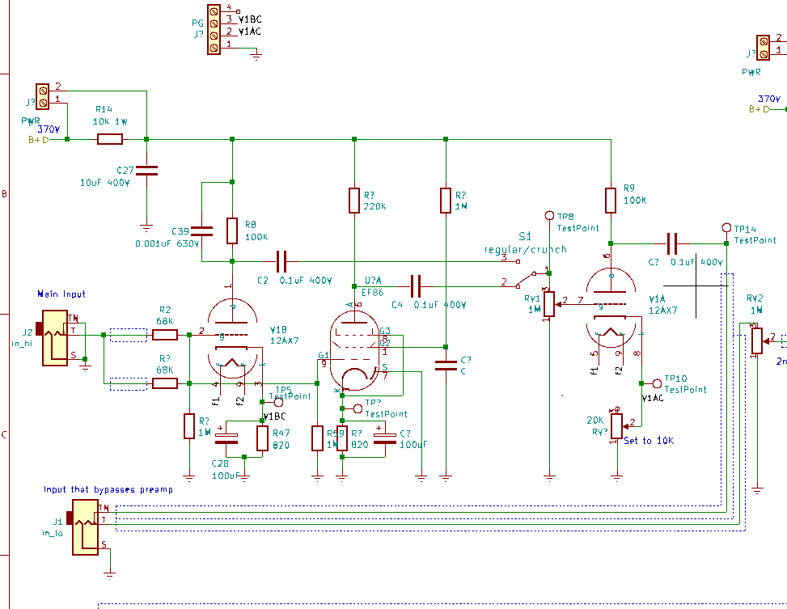

# Schematic of current state of the amplifier

I will try to update this to be as current as possible to how the amp is actually wired up.

> Refer to the original schematic PDF when needed.  Where possible component reference numbers were reused.

## Preamp

Notable changes:

* The input stage is no longer two parallel channels, but only one channel.

* You now have your choise of first stage preamp
  * A 12AX7 based on the original schematic. I added a plate bypass cap to help make it warmer (less high frequencies).
  * An EF86. This has a bit more gain and is a lot brighter sound to it.
* The second gain stage is a cathode clipper type configuration. The adjustable position lets me change the bias on the tube to allow it to distort more. I currently have this at about 2K
* Stock 2M pots for volume were changed to be 1M, mostly because this is all I could find. But also the old values seemed to do cause the amp to do oscillating or squealing when turned up.
* Added 1M grid stop resistor to be right before the input to the tube, instead of before the 68K resistors from the input jack.
* Using RG-178 coaxial wire for sensitive signal paths.

The power supply now supplies 4 additional tubes than the amp originally had. It seems way over sized for what it was designed to handle.

## Tone Stack

This is the most part the original tone stack. I just like how it sounds.

* The powr to V2 has been moved to go through a 10K resistor and a 10uF capacitor. I discovered by measuring with the scope there was a to 300mV 120Hz ripple on the power supply. This is as far as I can tell how the amplifier always was. It always had a small AC hum to it. I found I could swap out different tubes in this socket and make it get a bit better. But really what made the hum go away was the extra power supply filtering I added.
* The tube socket had pins 2 and 6 soldered together at the socket, under the filament wires. I was thinking this was picking up some of the noise from the AC filament wire that was right there. Sure enough, just rewiring this socket makes a little bit of improvement on not hearing hum on the speaker. This was another original assembly artifact or bug that I fixed with thea mp.
* There is now an effects send/return jacks. This amplifier did not have his. I like to use it a lot to add a noise gate, or digital delay effects after the preamp.
* The output of the tone stack (effects loop jacks) now goes to the reverb unit instead of the phase inverter.

## Reverb

This is an entirely new component. The amp originally did not have reverb effect.

I ordered a mod reverb tank from NextGenGuitars. They are right here in Ottawa, great service for having stuff shipped. It's almost as fast as DigiKey.

This circuit is based on a reverb circuit schematic I found on the internet. I think from "Tube Town Reverb Kit".  They specify to use an EL844. I tried an EL84 for fun. I can't really notice a difference. But it kind of feels like the EL84 can overdrive the reverb output transformer, so you can get some intereting sounds with that. For now I will stick with the EL844.

The power transformer in this amp seems to be way over sized and does not even blink when I add 3 more tubes. Which is convenient.

I took some time to wire up the discrete components on its own circuit board module, like the other parts of the amplifier. It is now a hairy wires mess inside. But it works. After some preliminary testing and tracing all the component connections before powering it on, it worked for me right out the door.

I am amused by the complexity. To add reverb, you basically build a mini amplifier, inside your amplifier. I can see why the modern amps use digital modelling circuits.

Though I really appreciate having a tube driven real spring reverb effect. It is so much better to me than a reverb effect pedal anyway.

* using RG-178 shielded wire for the sensitive audio paths, like return from the reverb tank to the regeneration triode.
## Output

* Replaced the "long tail pair" tube based phase inverter with a solid state op-amp phase inverter.
  * This required a +/-15V DC power supply. I achieved this using a small DC-DC converter and diode rectitifer attached to the filament supply.

I was having some of that terrible buzz that means the phase splitter is not tracking opposite phases like it should. The values are all the right ones and it appears to be working. But It is likely stray capacatance, or magic that is letting it not operate properly. I am tired of the magic of this too. The op-amp phase inverter is a lot more precise than the long tail pair circuit.

* The annoying buzz or background hum that was always there is now gone.
* Fixed the squealing when gain knobs or tone knobs are up.

> I was chasing several high frequency oscillations since adding the reverb circuit. Having the gain up a bit past mid point, or having the tone control for the reverb on would cause screeching or loud hum and buzzing. Like the phase inverter was not working properly from being loaded.
> I have a feeling some of the noise is coming from stray capacitance from the terribly arranged and too long unshielded wires everywhere.  It is a side quest to make the wires as short as possible.
> It would appear the op-amp phase inverter has helped a lot of these demonic problems now as well!

One thing I do worry about, is if the audio signal is ever hundreds of volts like it may have been in the tube amplifier, that would be ok for the tube phase inverter. But the op amp would get roasted.

I measured the input voltages, and it seems to be the order of a couple volts. So this is likely ok for the levels I plan on using the amplifer.

## Power Supply

* Removed the "death capacitor"
* Now having the V1 voltage to the output transformer switched. Before it was not switched by the bypass switch.
* I built a convenient custom circuit board, so these high voltage parts are safely tucked off to the side. This was among the first enhancements. The old turret board and chassis mounted capacitors had high voltage wires spread everywhere.
* Added a new module to use the [Recom RS-0505D](https://www.digikey.com/product-detail/en/recom-power/RS-0515D/945-1543-5-ND/2321270) to provide the +/-15V DC for the op amp in the phase inverter, by using the filament supply.
* Moved all the power entry chassis components to one corner. Before they were kind of sprawled over the back of the chassis.
* Added an IEC outlet after the power switch. This will allow me to switch the power to my pedal board from the amp switch now.

## Tremolo

This circuit has not changed much from the original. I replaced all the parts with new parts of the same value. Except for

* Changed C18 and C19 from 0.01uF to 0.02uF. This has the effect of making the oscillator operate a bit slower. I found before it was entirely too fast to be usable.
