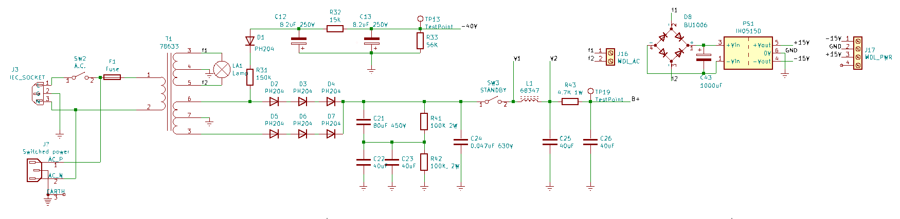

# Schematic of current state of the amplifier

I will try to update this to be as current as possible to how the amp is actually wired up.

> Refer to the original schematic PDF when needed.  Where possible component reference numbers were reused.

## Preamp

Notable changes:

* The input stage is no longer two parallel channels, but only one channel.
* The second gain stage can be switched to be in series before the main stage.
* The crunch stage now has its own separate cathode bypass resistor and capacitor.
* There is an effects send/return jacks after the tone stack, before the input to the phase inverter.
* Stock 2M pots for volume were changed to be 1M, mostly because this is all I could find. But also the old values seemed to do cause the amp to do oscillating or squealing when turned up.
* added 1M grid stop resistor to be right before the input to the tube, instead of before the 68K resistors from the input jack.

## Reverb

This is an entirely new component. The amp originally did not have reverb effect.

> At this time, this is still under development.

## Output

* Added a 100 ohm variable resistor before the screen resistors to have the weighting adjusted so that

> I plan to add banana jacks to the chassis so I can insert a meter probe to measure resistor and voltage drops (to compute current) without needing to take apart the amp. These will be on the chassis beside this potentiometer and behind the power tubes.

## Power Supply

* Removed the "death capacitor"
* Now having the V1 voltage to the output transformer switched. Before it was not switched by the bypass switch.
* I built a convenient custom circuit board, so these high voltage parts are safely tucked off to the side. This was among the first enhancements. The old turret board and chassis mounted capacitors had high voltage wires spread everywhere.
